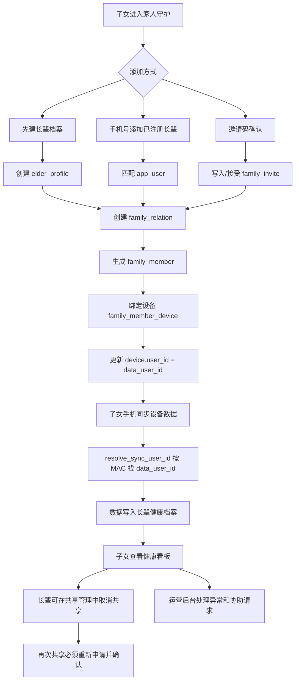

# 家人守护业务逻辑与处理流程

更新时间：2026-07-26
依据范围：当前 `wechat_ble` 仓库内小程序、FastAPI 后端、后台管理端代码。

## 1. 结论摘要

当前“家人守护”已经形成一条完整闭环：

1. 子女/守护人在小程序中添加长辈档案或绑定已有长辈账号。
2. 系统建立 `family_relation` 授权关系，并同步生成子女视角的 `family_member`。
3. 子女可为长辈绑定戒指设备，后续设备同步数据按设备归属写入长辈健康档案。
4. 子女端查看设备状态、生命体征、睡眠和活动数据；当前业务不提供子女照护提醒和 AI 摘要/周报/月报。
5. 长辈端可进入“长辈模式”查看谁在看自己的数据；共享管理只保留“取消共享”。
6. 共享一旦取消便不可直接恢复，双方必须重新发起申请并确认，生成一条新的有效关系。
7. 运营后台提供共享治理能力：查看关系、邀请、老人档案、设备归属日志、异常聚合、协助请求，并处理异常关系或协助请求。

业务核心不是“把子女账号和长辈账号混在一起”，而是通过 `family_member_device.device_mac -> data_user_id` 做数据归属路由：子女手机同步长辈戒指时，后端把数据写入长辈 `data_user_id`。

## 2. 参与角色

| 角色 | 代码字段/身份 | 主要动作 |
|---|---|---|
| 子女/守护人 | `guardian_user_id`、`owner_user_id` | 添加家人、绑定设备、查看授权数据、创建家庭组、提交协助请求 |
| 长辈/被守护人 | `elder_user_id`、`data_user_id` | 佩戴设备、同步数据、认领档案、管理共享授权 |
| 运营管理员 | 后台 admin 用户 | 处理异常、暂停/恢复/取消共享、接单/完成/关闭协助请求、审计 |
| 设备 | `device.mac`、`family_member_device.device_mac` | 作为数据归属判断依据 |

## 3. 核心数据模型

| 表 | 作用 | 关键字段 |
|---|---|---|
| `family_member` | 子女端看到的家人卡片，是守护人视角的成员记录 | `owner_user_id` 子女、`data_user_id` 健康数据归属用户、`linked_user_id` 已绑定真实账号、`relation_id`、`permissions`、`status` |
| `family_relation` | 长辈与守护人的授权关系主表 | `elder_user_id`、`elder_profile_id`、`guardian_user_id`、`permission_scope`、`status`、`source` |
| `elder_profile` | 长辈档案，可先由子女创建，后续由长辈本人认领 | `creator_user_id`、`real_user_id`、`claim_status`、基础资料 |
| `family_invite` | 邀请码记录 | `invite_code`、`invite_type`、`target_phone`、`status`、`expire_time` |
| `family_member_device` | 家人成员和设备 MAC 的归属关系 | `member_id`、`owner_user_id`、`data_user_id`、`device_mac`、`status` |
| `device_bind_log` | 设备绑定/强制重绑日志 | `device_mac`、`old_user_id`、`new_user_id`、`operator_user_id`、`reason` |
| `family_care_subscription` | 历史照护提醒订阅记录，当前家人守护流程不再使用 | `subscribe_enabled`、`template_ids`、`last_request_status` |
| `family_group` / `family_group_relation` | 家庭协同照护分组 | `owner_user_id`、`group_name`、`relation_id` |
| `family_assist_request` | 人工协助请求 | `requester_user_id`、`relation_id`、`member_id`、`request_type`、`status`、`result_note` |
| `family_relation_audit` | 后台关系治理审计 | `relation_id`、`old_status`、`new_status`、`operator_user_id`、`action`、`reason` |

## 4. 状态定义

### 4.1 共享关系状态 `family_relation.status`

| 值 | 含义 | 前端影响 |
|---:|---|---|
| 0 | 待确认 | 不应作为正常可看护关系使用 |
| 1 | 生效 | 可按权限查看数据 |
| 2 | 已暂停 | `has_permission` 返回 false，健康数据接口被拦截 |
| 3 | 已取消 | 关系关闭；删除关系时会同步软删 `family_member` |
| 4 | 已拒绝 | 邀请拒绝后的终态之一 |

### 4.2 邀请状态 `family_invite.status`

| 值 | 含义 |
|---:|---|
| 0 | 待处理 |
| 1 | 已接受 |
| 2 | 已拒绝 |
| 3 | 已过期 |
| 4 | 已取消 |

### 4.3 协助请求状态 `family_assist_request.status`

| 值 | 含义 | 处理方 |
|---:|---|---|
| 0 | 待处理 | 运营后台 |
| 1 | 处理中 | 运营后台 |
| 2 | 已完成 | 运营后台，必须写处理备注 |
| 3 | 已关闭 | 运营后台，必须写处理备注 |

## 5. 默认共享权限

关系建立后沿用统一的数据访问范围：

```text
vitalSigns  生命体征
sleep       睡眠
motion      活动
deviceStatus 设备状态
```

后端权限规则：

- 关系不是 `active` 时，所有权限视为不可用。
- 查看生命体征、睡眠、活动前，后端仍按历史 `permissions` / `permission_scope` 做兼容性校验。
- 长辈共享管理不提供逐项调整权限入口；历史权限字段继续用于兼容存量关系和子女侧未认领档案流程。

## 6. 主流程一：子女添加家人

入口：`pages/family/family` -> `pages/family/addMember`

### 6.1 先建档案

适合场景：子女先准备设备，长辈未注册或不方便操作。

处理流程：

1. 子女填写姓名、关系、手机号、性别、生日、身高、体重。
2. 小程序调用 `POST /app/family/elder-profile`。
3. 后端 `create_elder_profile_with_relation -> create_member`：
   - 如果手机号能匹配已有 `app_user`，使用该用户作为 `linked_user_id` / `data_user_id`。
   - 如果没有匹配用户，创建一个 shadow user 作为长辈数据档案用户。
   - 写入 `elder_profile`。
   - 写入 `family_relation`，状态默认 `active`。
   - 写入 `family_member`，作为子女端家人卡片。
4. 返回 `memberId`、`relationId`、`elderProfileId`、`elderUserId`。
5. 前端跳转到家人详情。

### 6.2 手机号添加

适合场景：长辈已经注册小程序。

处理流程：

1. 子女输入手机号。
2. 小程序调用 `GET /app/family/users/search`。
3. 后端按手机号查 `app_user`，返回脱敏昵称和手机号。
4. 前端再调用 `POST /app/family/elder-profile` 创建关系。
5. 后端会把已注册用户作为 `linked_user_id` / `data_user_id`，并创建已认领档案。

如果手机号未找到用户，前端提示可切换到“先建档案”。

### 6.3 邀请码

当前存在两类邀请：

| `invite_type` | 业务含义 | 创建入口 | 接受后动作 |
|---:|---|---|---|
| 1 | 长辈邀请家人查看自己的数据 | 长辈“共享管理”邀请家人 | 当前接受者成为守护人，系统为其建立/补齐 `family_member` |
| 2 | 子女邀请长辈确认共享/认领 | 子女“添加家人-邀请码” | 当前接受者作为长辈，建立长辈与邀请人的关系；如果有关联档案，再执行档案认领 |

邀请统一规则：

- 邀请码由后端生成，格式类似 `FAMxxxxxx`。
- 默认有效期 7 天。
- 若设置 `target_phone`，只有该手机号登录用户可接受。
- 接受后 `status=1`，拒绝后 `status=2`，过期后 `status=3`。

## 7. 主流程二：绑定长辈设备

入口：`pages/family/memberDetail` -> `pages/family/bindDevice`

### 7.1 前端来源

绑定页支持两种设备信息来源：

1. 使用本机已连接设备：读取本地当前已绑定/连接的戒指身份。
2. 扫码/手动输入：填写设备 MAC / SN。

对于 RW 设备，前端会做 MAC 归一化：

- 优先使用 `mac`
- 其次使用广播里的 `advertis.macInfo`
- 再使用形如 `AA:BB:CC...` 的 `uniMacId` 或 `deviceId`

### 7.2 后端绑定逻辑

接口：

- `POST /app/family/device/bind`
- `POST /app/family/elders/{relationId}/devices/bind`

处理流程：

1. 校验 `memberId` 是否属于当前守护人。
2. 校验关系必须为 `active`。
3. 校验 MAC 不为空。
4. 查询 `device` 和 `family_member_device`，判断该 MAC 是否已绑定到其他 `data_user_id`。
5. 如果已属于其他健康档案且没有 `forceBind`，后端返回错误。
6. 前端弹窗二次确认；用户确认后带 `forceBind=true` 重试。
7. 后端确保 `device` 表存在该设备。
8. 将旧的 `family_member_device` 活跃记录置为 `replaced` / 软删。
9. 新增家人成员设备绑定记录。
10. 更新 `device.user_id = family_member.data_user_id`。
11. 写入 `device_bind_log`：
    - 普通绑定：`family_guardian_bind`
    - 强制重绑：`family_guardian_force_rebind`

### 7.3 数据归属规则

这是家人守护最重要的规则。

当子女手机上传设备数据时，`POST /app/data/sync` 会读取 `deviceMac`：

1. 后端调用 `family.resolve_sync_user_id(owner_user_id, device_mac)`。
2. 如果当前登录用户是该设备绑定记录的 `owner_user_id`，且设备 MAC 命中活跃 `family_member_device`，则把数据写入对应 `data_user_id`。
3. 如果没有命中家人设备绑定，则按当前登录用户自己的 `user_id` 写入。

因此：

- 子女同步“家人绑定设备”的数据，写入长辈档案。
- 子女同步自己的设备，写入自己档案。
- 设备 MAC 是归属判断的核心键。

## 8. 主流程三：家人守护首页

入口：`pages/family/family`

前端加载：

1. 调用 `GET /app/family/home` 获取首页数据。
2. 如果失败，兜底调用：
   - `GET /app/family/member/list`

后端 `family_home` 返回：

| 字段 | 含义 |
|---|---|
| `members` | 已按关注优先级排序的家人列表 |
| `guardians` | 当前用户作为长辈时，正在查看自己数据的守护人 |
| `pendingInviteCount` | 待处理邀请数量 |
| `stats.total` | 守护家人数 |
| `stats.syncedToday` | 今天有同步记录的人数 |
| `stats.needAttention` | 需要关注人数 |
| `stats.unbound` | 未绑定设备人数 |
| `stats.guardians` | 正在守护当前用户的人数 |
| `summaryText` | 首页摘要文案 |

成员关注等级：

| 等级 | 判断规则 | 优先级 |
|---|---|---:|
| `unbound` | 未绑定设备 | 90 |
| `unsynced` | 已绑定但超过 24 小时未同步 | 80 |
| `attention` | 低电量或健康指标异常 | 50-95 |
| `normal` | 今日状态稳定 | 0 |

触发关注的健康/设备条件：

- 未绑定设备
- 超过 24 小时未同步
- 设备电量 `<=20`
- 平均血氧 `<93`
- 平均心率 `>110` 或 `<50`
- 睡眠评分 `<60`

## 9. 主流程四：家人详情与健康数据查看

入口：`pages/family/memberDetail`

前端根据参数选择接口：

- 有 `relationId`：走 `/app/family/elders/{relationId}/...`
- 只有 `memberId`：走 `/app/family/health/dashboard`

详情页展示：

1. 总体状态：有 danger 提醒则“需要尽快关注”，有 warning/info 则“有事项需关注”，否则“今日状态平稳”。
2. 设备状态：是否绑定、是否在线、最近同步、电量。
3. 核心指标：心率、血氧、睡眠评分、活动评分。
4. 基础健康状态说明。

当前详情页不请求、不展示 AI 今日摘要、AI 周报或 AI 月报。

后端权限过滤：

- `deviceStatus=false`：不返回设备状态。
- `vitalSigns=false`：不返回心率、血氧、皮肤温度、HRV、压力等生命体征。
- `sleep=false`：不返回睡眠。
- `motion=false`：不返回活动。
- `alerts`、`aiSummary` 为历史兼容字段，当前页面不提供子女提醒或 AI 报告入口。

当前后端还做了长辈视角指标格式化：

- 心率、血氧、HRV、压力等按整数返回。
- 皮肤温度保留 1 位小数。

## 10. 主流程五：共享关系管理

### 10.1 子女侧共享权限页

入口：`pages/family/sharePermission`

用途：

- 子女查看或调整某位家人的共享权限。
- 保存时会先调用 `PUT /app/family/relations/{relationId}` 更新关系权限，再调用 `POST /app/family/share/updatePermissions` 同步成员权限。

限制：

- 如果长辈档案已经被本人认领，子女不能单方面扩大/调整共享授权。
- 此时权限调整应由长辈本人在“长辈模式 -> 共享管理”完成。

### 10.2 长辈侧共享管理

入口：`pages/family/shareManage`

长辈可以：

1. 查看谁正在看自己的健康数据。
2. 取消现有共享关系。
3. 生成 7 天有效的邀请码邀请家人。

长辈共享管理页面不再提供“暂停共享”“恢复共享”和“调整权限”。取消共享有二次确认，并明确提示取消后必须重新申请。取消后后端会：

- 将 `family_relation.status` 置为 `cancelled`。
- 将 `family_relation.del_flag` 软删。
- 同步软删对应 `family_member`。

需要再次共享时：

1. 长辈重新生成邀请，或子女重新发起家人申请。
2. 对方重新确认申请。
3. 后端新建或重新激活一条有效关系，并重新生成守护人视角成员记录。
4. 不能通过原关系执行“恢复”操作。

## 11. 主流程六：长辈模式

入口：

- `pages/family/elderHome`
- `pages/family/elderDevice`
- `pages/family/shareManage`
- `pages/family/inviteList`

长辈模式的设计目标是降低长辈操作成本：

1. 长辈看到自己的健康摘要、生命体征、睡眠、活动和设备状态。
2. 如果未绑定设备，引导“联系家人绑定设备”。
3. 如果已绑定设备，引导打开同步页面。
4. 显示当前有哪些家人在看自己的数据。
5. 支持处理家人邀请；共享管理仅支持取消现有关系。

长辈模式调用的是当前登录长辈自己的健康接口，例如：

- `getHealthSummary`
- `getVitalSign`
- `getSleepOverview`
- `getMotionOverview`
- `getBindInfo`
- `getFamilyGuardians`
- `getFamilyInvites`

## 12. 已下线能力

以下能力已从当前家人守护产品流程移除：

1. 子女端照护提醒列表。
2. 子女端微信提醒订阅入口。
3. AI 今日健康摘要。
4. AI 看护周报。
5. AI 看护月报。
6. 长辈侧暂停共享、恢复共享。
7. 长辈侧逐项调整共享权限。

历史接口和数据表可暂时保留用于兼容旧版本，但新页面不再请求这些接口，也不再展示对应入口。

## 13. 主流程八：协同照护与人工协助

入口：`pages/family/familyCollaborate`

当前功能包含两块：

### 13.1 家庭组

1. 前端读取 `GET /app/family/groups`。
2. 可用当前已有家人关系一键创建默认家庭照护组。
3. 后端写入 `family_group` 和 `family_group_relation`。

家庭组当前更像协同照护的基础结构，后续可承载多子女共同查看、提醒分发、周报/月报共享等。

### 13.2 人工协助请求

1. 用户选择需要协助的家人。
2. 填写联系电话、设备 MAC、问题描述。
3. 调用 `POST /app/family/assist`。
4. 后端写入 `family_assist_request`，默认状态 `待处理`。
5. 后台运营端可接单、完成或关闭。

## 14. 运营后台治理流程

入口：后台 `family/share/index.vue`

后台标签页覆盖：

- 共享关系
- 邀请记录
- 老人档案
- 设备归属日志
- 共享审计
- 家人成员
- 家庭组
- 协助请求
- 异常聚合

### 14.1 异常聚合

接口：`GET /admin/family/abnormal/list`

聚合来源：

1. 非生效共享关系：待确认、暂停、取消、拒绝。
2. 未处理或已过期邀请。
3. 未认领老人档案。
4. 设备强制重绑记录。
5. 家人设备超过 24 小时未同步。
6. 待处理/处理中人工协助请求。

### 14.2 共享关系治理

接口：`PUT /admin/family/relation/{relation_id}/status`

后台可设置：

- `1` 生效
- `2` 暂停
- `3` 取消

要求：

- 必须填写操作原因。
- 同步更新 `family_member.status`。
- 写入 `family_relation_audit` 审计记录。

### 14.3 协助请求处理

接口：`PUT /admin/family/assist/{request_id}/status`

后台可设置：

- `1` 处理中
- `2` 已完成
- `3` 已关闭

要求：

- 完成或关闭时必须填写处理备注。
- 记录操作管理员 ID、名称和处理说明。

## 15. 当前接口清单

### 小程序端 `/app/family/*`

| 接口 | 用途 |
|---|---|
| `GET /app/family/home` | 家人守护首页 |
| `GET /app/family/member/list` | 家人列表兜底 |
| `POST /app/family/elder-profile` | 创建长辈档案和守护关系 |
| `POST /app/family/member/add` | 添加家人成员 |
| `GET /app/family/member/detail` | 家人成员详情 |
| `POST /app/family/member/remove` | 移除家人成员 |
| `GET /app/family/users/search` | 按手机号搜索用户 |
| `POST /app/family/invite` | 生成邀请码 |
| `GET /app/family/invite/list` | 邀请列表 |
| `POST /app/family/invite/{inviteCode}/accept` | 接受邀请 |
| `POST /app/family/invite/{inviteCode}/reject` | 拒绝邀请 |
| `POST /app/family/elder-profile/{profileId}/claim` | 长辈认领档案 |
| `GET /app/family/guardians` | 当前用户作为长辈时，查看守护人 |
| `PUT /app/family/relations/{relationId}` | 更新关系状态/权限/展示名 |
| `DELETE /app/family/relations/{relationId}` | 取消共享关系 |
| `POST /app/family/share/updatePermissions` | 更新成员权限 |
| `POST /app/family/device/bind` | 绑定家人设备 |
| `POST /app/family/elders/{relationId}/devices/bind` | 按关系绑定家人设备 |
| `GET /app/family/health/dashboard` | 家人健康看板 |
| `GET /app/family/health/index` | 家人健康首页数据，按权限过滤 |
| `GET /app/family/data/vitalSign` | 家人生命体征 |
| `GET /app/family/data/sleep/sleepOverview` | 家人睡眠 |
| `GET /app/family/data/motion/motionOverview` | 家人活动 |
| `GET /app/family/alert/list` | 家人异常提醒 |
| `GET /app/family/ai/dailySummary` | 历史兼容接口，当前页面不调用 |
| `GET /app/family/ai/weeklyReport` | 历史兼容接口，当前页面不调用 |
| `GET /app/family/ai/monthlyReport` | 历史兼容接口，当前页面不调用 |
| `GET /app/family/care/reminders` | 历史兼容接口，当前页面不调用 |
| `POST /app/family/care/subscribe` | 历史兼容接口，当前页面不调用 |
| `GET /app/family/groups` | 家庭组列表 |
| `POST /app/family/groups` | 创建家庭组 |
| `POST /app/family/groups/{groupId}/relations` | 家庭组添加关系 |
| `GET /app/family/assist/list` | 协助请求列表 |
| `POST /app/family/assist` | 创建协助请求 |

### 后台端 `/admin/family/*`

| 接口 | 用途 |
|---|---|
| `GET /admin/family/abnormal/list` | 家人守护异常聚合 |
| `PUT /admin/family/relation/{relation_id}/status` | 暂停/恢复/取消共享关系 |
| `PUT /admin/family/assist/{request_id}/status` | 接单/完成/关闭协助请求 |

后台通用 CRUD 还覆盖：

- `family/relation`
- `family/invite`
- `family/elderProfile`
- `family/deviceBindLog`
- `family/relationAudit`
- `family/member`
- `family/group`
- `family/groupRelation`
- `family/assistRequest`

## 16. 端到端流程图



## 17. 测试关注点

建议按以下用例验证：

1. 子女先建档案：是否生成 `memberId/relationId/elderProfileId`。
2. 手机号添加：已注册手机号是否写入真实 `data_user_id`。
3. 邀请类型 1：长辈邀请子女后，子女接受是否成为守护人。
4. 邀请类型 2：子女邀请长辈后，长辈接受是否建立共享关系；有关联档案时是否完成认领。
5. 设备普通绑定：`device.user_id` 是否改为长辈 `data_user_id`。
6. 设备冲突绑定：首次应阻止；确认强制绑定后才允许，并写 `family_guardian_force_rebind`。
7. 数据同步：子女账号上传家人设备 MAC，健康数据是否写到长辈账号。
8. 关系取消：取消后 `family_relation` 和 `family_member` 是否软删。
9. 取消后重进共享管理：原关系是否不再显示，也没有暂停/恢复/权限调整入口。
10. 重新共享：是否必须重新发起邀请/申请并由对方确认。
11. 家人首页：是否不再请求、展示子女照护提醒与订阅入口。
12. 家人详情：是否不再请求、展示 AI 今日摘要、周报和月报。
13. 后台协助请求：待处理 -> 处理中 -> 已完成/已关闭状态是否正确，完成/关闭是否强制填写备注。

仓库中已有相关验证脚本：

```text
admin_fastapi/scripts/verify_family_admin_abnormal_unsynced.py
admin_fastapi/scripts/verify_family_admin_audit.py
admin_fastapi/scripts/verify_family_care_reminders.py
admin_fastapi/scripts/verify_family_device_conflict.py
admin_fastapi/scripts/verify_family_elder_invite_guardian.py
admin_fastapi/scripts/verify_family_group_assist.py
admin_fastapi/scripts/verify_family_health_sharing.py
admin_fastapi/scripts/verify_family_home_cards.py
admin_fastapi/scripts/verify_family_invite_claim.py
admin_fastapi/scripts/verify_family_invite_expiry.py
admin_fastapi/scripts/verify_family_pause_resume.py
admin_fastapi/scripts/verify_family_privacy_masking.py
admin_fastapi/scripts/verify_family_weekly_report.py
```

## 18. 当前代码依据

小程序端：

- `smart-wearable-devices-sdk/src/pages.json`
- `smart-wearable-devices-sdk/src/common/api/family.ts`
- `smart-wearable-devices-sdk/src/pages/family/family.vue`
- `smart-wearable-devices-sdk/src/pages/family/addMember.vue`
- `smart-wearable-devices-sdk/src/pages/family/memberDetail.vue`
- `smart-wearable-devices-sdk/src/pages/family/bindDevice.vue`
- `smart-wearable-devices-sdk/src/pages/family/sharePermission.vue`
- `smart-wearable-devices-sdk/src/pages/family/elderHome.vue`
- `smart-wearable-devices-sdk/src/pages/family/elderDevice.vue`
- `smart-wearable-devices-sdk/src/pages/family/shareManage.vue`
- `smart-wearable-devices-sdk/src/pages/family/inviteList.vue`
- `smart-wearable-devices-sdk/src/pages/family/familyCollaborate.vue`

后端：

- `admin_fastapi/app/api/app.py`
- `admin_fastapi/app/services/family.py`
- `admin_fastapi/app/api/admin.py`

后台管理端：

- `admin_frontend/znzh-frontend-admin/src/views/family/share/index.vue`
- `admin_frontend/znzh-frontend-admin/src/api/family/share.js`

## 19. 待确认/风险点

1. 邀请类型 1 和 2 的产品文案需要统一明确：一个是“长辈邀请家人查看我”，一个是“子女邀请长辈确认/认领”。
2. 历史版本可能仍调用提醒、AI 报告、暂停/恢复或权限调整接口；后端兼容接口暂不删除，待旧版本退出后再统一清理。
3. 家庭组当前主要是结构化承载，多子女协同的实际权限/消息分发还需要继续明确。
4. 人工协助请求目前只进入后台处理流，用户侧没有看到运营处理过程的详细时间线。
5. 设备数据归属高度依赖 `deviceMac` 稳定性；RW 设备必须确保上传时 MAC 取值和绑定时一致。
6. 家人守护展示的健康指标属于日常参考，不应作为医疗诊断结论。
