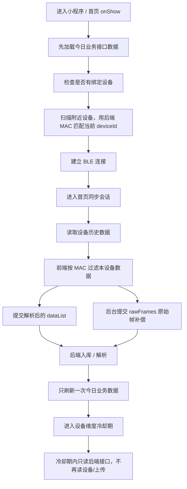

# 首页连接、同步、刷新链路说明

更新时间：2026-08-06

## 目标

用户进入小程序首页后，只允许一次“连接设备 → 同步设备数据 → 上传/解析 → 刷新今日业务数据”的完整链路。完成后进入短时间冷却期，期间切换页面、回到首页、进入详情页都只读取后端业务接口，不再触发设备历史读取或上传。

## 正常链路

## 关键规则

1. 首页是自动同步的唯一入口。
2. 其他页面只判断蓝牙状态；已连接就直接请求后端业务数据，未连接只做后台静默重连，不触发历史读取和上传。
3. 自动同步按设备维度加冷却期，当前设置为 5 分钟。
4. 手动下拉刷新允许强制同步，用于测试和用户主动刷新。
5. 同步完成后的最终刷新只执行一次；同步期间排队的普通刷新会在最终刷新后丢弃。
6. 本次上传 session 关闭后，`localData` 后续变化不能再次唤醒同一批上传。

## 当前前端落点

- 首页页面：`smart-wearable-devices-sdk/src/pages/awareness/awareness.vue`
- RW 首页同步：`syncRwHomeHistoryAndRefreshOverview`
- L19/legacy 首页同步：`executeCommandsSequentially` + `startLegacyHomeHistoryReadInBackground` + `localData` watcher
- 业务刷新：`refreshAwarenessBusinessOverview`
- 同步完成后最终刷新：`refreshAwarenessAfterDataProcessed`
- 冷却闸门：`isAwarenessHomeSyncInCooldown` / `markAwarenessHomeSyncCompleted`

## 日志判断

- `home-sync-session-claimed`：本次首页同步会话已占用。
- `home-sync-session-skipped`：同一前台会话重复触发，被拦截。
- `home-sync-cooldown-skip`：设备处于冷却期，跳过读设备/上传。
- `home-sync-cooldown-mark`：本设备进入冷却期。
- `business-overview-refresh-queue-drop`：最终刷新已完成，丢弃排队的普通刷新。
- `business-processed-refresh-result`：同步后的最终业务数据刷新完成。

## 后续优化边界

如果还出现卡慢，优先查：

1. 是否还有非首页页面调用设备历史读取或上传。
2. `business-overview-request-*` 分段耗时里哪个后端接口慢。
3. `history-page-sync-*` 是否仍在详情页触发设备同步。
4. 是否因为 deviceId/MAC 映射错误导致绑定设备串号。
