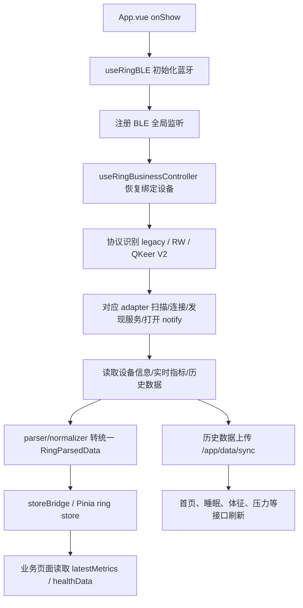

# 前端文件地图与主要逻辑说明

生成时间：2026-07-30  
项目目录：`E:\qkeer\code\wechat_ble\smart-wearable-devices-sdk`

本文档整理当前 uni-app / Vue3 小程序前端源码的文件分布、主要职责和业务流向。范围以 `src`、前端配置和直接相关脚本为主；不展开 `node_modules`、`dist`、`.tmp`、`outputs`、历史调试 JSON 日志等运行产物。

## 1. 项目技术栈与入口

| 文件 | 主要逻辑 |
| --- | --- |
| `package.json` | 项目依赖与脚本。核心脚本包括 `dev:mp-weixin`、`build:mp-weixin`、`type-check`、RW/L19 审计与 release 验证脚本。 |
| `vite.config.ts` | uni-app Vite 构建配置。 |
| `tsconfig.json` | TypeScript 配置。 |
| `project.config.json` | 微信小程序项目配置。 |
| `src/main.ts` | Vue SSR app 创建入口，安装 Pinia、uv-ui、全局 share mixin、HTTP Request 初始化。 |
| `src/App.vue` | 应用生命周期入口：`onLaunch` 安装错误提示保护；`onShow` 初始化蓝牙、注册监听、恢复业务自动刷新与上次绑定设备；`onHide` 暂停自动刷新并重置蓝牙 ready 状态。 |
| `src/pages.json` | 小程序页面、分包、tabBar、全局样式配置。主 tab 为感知首页、健康、我的；详情页集中在 `homeDetail` 分包。 |
| `src/manifest.json` | 小程序 manifest，含 appid、权限、懒加载等。 |
| `src/uni.scss` | uni-app 全局变量与样式。 |
| `src/app.lifecycle.parity.ts` | App 生命周期兼容/审计辅助文件。 |
| `src/manifest.parity.ts` | manifest 兼容/审计辅助文件。 |
| `src/sourceEncoding.parity.ts` | 源码编码审计辅助文件。 |

## 2. 总体业务流

关键约定：

- 页面不要直接解析协议字节，优先通过 `useRingBusinessController()`、`useRingBusinessData()` 或 store 的 `latestMetrics/healthData` 读取统一指标。
- L19、RW、QKeer V2 的协议差异收敛在 `src/sdk/ring-ble`。
- 历史数据上传统一走 `/app/data/sync`，提交前由 `localHistorySubmit.ts` / `useRingHistoryUpload.ts` 做时间、设备 MAC、字段、去重和过滤处理。
- `.parity.ts` 是迁移审计/兼容校验文件，默认不作为业务修改入口。
- `.backup.vue` 是旧版本 UI/逻辑备份，不应反复覆盖当前稳定实现。

## 3. 一级目录职责

| 目录 | 主要职责 |
| --- | --- |
| `src/api` | 新 SDK/新业务使用的轻量 API 封装，含戒指绑定、历史上传、AI 闺蜜 H5 等。 |
| `src/common/api` | 旧页面和业务页面共用接口层，包含首页详情、家庭守护、设备、用户、登录、上传等。 |
| `src/components` | 全局 UI 组件，如自定义 tabbar、图表、进度条、弹窗 picker、SVG 组件等。 |
| `src/composables` | 业务组合逻辑层，尤其是蓝牙 SDK 门面、业务 controller、历史上传、前台测量、OTA 管理。 |
| `src/features` | 迁移中的 feature 聚合层，当前主要承接 ring 统一健康入口。 |
| `src/pages` | 主包页面：感知首页、健康、家人守护、我的、登录、webview、调试页等。 |
| `src/pagesA` | 分包页面：设备连接/设置/OTA/个人信息，以及健康报告类页面。 |
| `src/homeDetail` | 首页健康数据详情分包：睡眠、体征、活动、压力/放松、女性周期等详情页和编辑卡片页。 |
| `src/sdk` | 蓝牙协议 SDK 和 OTA SDK，业务页面不应直接操作底层字节。 |
| `src/stores` | Pinia 状态：戒指状态、用户状态、旧页面 facade。 |
| `src/utils` | 通用工具：请求、绑定信息、蓝牙错误文案、诊断日志、数据上传、数值格式化。 |
| `src/types` | 接口与全局类型声明。 |
| `src/static` / `src/assets` | 图片、tabbar、SVG、echarts 脚本等静态资源。 |
| `src/styles` | 全局 SCSS 工具样式、agent 风格样式。 |
| `src/uni_modules` | 第三方 uni 组件依赖，不在本文逐文件展开。 |

## 4. 页面路由与主业务

### 4.1 主包页面 `src/pages`

| 文件 | 主要逻辑 |
| --- | --- |
| `src/pages/awareness/awareness.vue` | 感知首页。展示睡眠、活动、压力、生命体征等首页卡片；触发绑定设备恢复、数据同步、业务接口刷新。 |
| `src/pages/awareness/echartOptions.ts` | 首页图表配置，主要服务活动、压力、体征等小图。 |
| `src/pages/awareness/aiApply.vue` | AI 相关申请/入口页面。 |
| `src/pages/awareness/aiLab.vue` | AI Lab 页面。 |
| `src/pages/health/health.vue` | 健康页，展示健康服务/功能入口；AI 闺蜜 Label 已从小程序健康页移除，H5 站点走独立入口。 |
| `src/pages/health/echartOptions.ts` | 健康页图表配置。 |
| `src/pages/health/growth-girlfriend.vue` | AI 闺蜜 H5 页面容器，仅 H5 条件编译使用，不走小程序通道。 |
| `src/pages/mine/mine.vue` | 我的页。展示用户、设备连接状态、家人守护、长辈模式、设备信息、功能设置、使用指南、诊断等入口。 |
| `src/pages/login/login.vue` | 登录页。处理登录响应、token 写入、用户信息刷新。 |
| `src/pages/login/login-mobile.vue` | 手机号登录页。 |
| `src/pages/login/agreement.vue` | 用户协议页。 |
| `src/pages/login/login.backup.vue` | 登录页旧实现备份。 |
| `src/pages/family/family.vue` | 家人守护首页，展示家庭成员、设备同步状态、提醒摘要、共享关系入口。 |
| `src/pages/family/addMember.vue` | 添加家人/父母页面，创建或搜索家庭成员。 |
| `src/pages/family/memberDetail.vue` | 家人详情，加载成员设备、健康数据、设备绑定状态。 |
| `src/pages/family/bindDevice.vue` | 家人设备绑定，支持搜索绑定；绑定时 serviceId 不作为用户输入项。 |
| `src/pages/family/sharePermission.vue` | 共享权限页面。 |
| `src/pages/family/shareManage.vue` | 共享管理。只保留取消共享；取消后需重新申请。 |
| `src/pages/family/inviteList.vue` | 家人邀请列表。 |
| `src/pages/family/familyCollaborate.vue` | 协同照护/家庭协作页面。 |
| `src/pages/family/elderHome.vue` | 长辈模式首页，读取长辈健康概览与设备同步数据。 |
| `src/pages/family/elderDevice.vue` | 长辈模式设备信息页。 |
| `src/pages/ring/business.vue` | 内部业务验证页，统一测试扫描、连接、刷新、同步、指标展示。 |
| `src/pages/ring/debug.vue` | 内部协议/设备调试页，主要用于真实设备命令验证。 |
| `src/pages/businessHistoryPageSync.parity.ts` | 业务历史同步页面兼容审计。 |
| `src/pages/legacyRoutes.parity.ts` | 旧路由兼容审计。 |
| `src/pages/webview-custom/webview-custom.vue` | 自定义 webview 容器。 |
| `src/pages/webview/webview.vue` | 旧 webview 页面。 |
| `src/pages/home/index.vue` | 历史/兼容首页入口。 |
| `src/pages/index/index.vue` | 默认模板入口/兼容页。 |
| `src/pages/test/testEcharts.vue` | ECharts 测试页。 |
| `src/pages/test/testEquipment.vue` | 设备测试页。 |

### 4.2 我的/设备分包 `src/pagesA/mines`

| 文件 | 主要逻辑 |
| --- | --- |
| `src/pagesA/mines/connectDevice.vue` | 连接/绑定设备页。搜索戒指、点击连接、绑定写入；连接中按钮禁用并显示等待态。 |
| `src/pagesA/mines/profile.vue` | 个人信息页。头像为空时应使用默认戒指图；编辑昵称、生日、性别、身高、体重等。 |
| `src/pagesA/mines/editNickname.vue` | 昵称编辑页。 |
| `src/pagesA/mines/device.vue` | 设备信息页。展示连接状态、电量、固件/软件版本、序列号、设备名、MAC；含解除绑定、戒指查找红灯、刷新设备信息。 |
| `src/pagesA/mines/setting.vue` | 功能设置页。采集周期、卡目标等应读后端/数据库，保存后回显并清理底部连接提示。 |
| `src/pagesA/mines/otaUpgrade.vue` | OTA 升级页。无升级版本时显示“当前已是最新版本”。 |
| `src/pagesA/mines/guide.vue` | 使用指南页。 |
| `src/pagesA/mines/question.vue` | 常见问题页。 |
| `src/pagesA/mines/detail.vue` | 我的页相关通用详情页。 |

### 4.3 健康报告分包 `src/pagesA/healths`

| 文件 | 主要逻辑 |
| --- | --- |
| `src/pagesA/healths/deviceData.vue` | 设备测量数据页。 |
| `src/pagesA/healths/healthReport.vue` | 健康报告页。 |
| `src/pagesA/healths/indicatorDetail.vue` | 健康指标详情页。 |
| `src/pagesA/healths/activityIntensity.vue` | 活动强度说明/分析页。 |
| `src/pagesA/healths/exerciseRegularity.vue` | 运动规律分析页。 |
| `src/pagesA/healths/sedentaryRisk.vue` | 久坐风险分析页。 |
| `src/pagesA/healths/sleepPrep.vue` | 睡前准备分析页。 |
| `src/pagesA/healths/sleepRecovery.vue` | 睡眠恢复分析页。 |
| `src/pagesA/healths/sleepRhythm.vue` | 睡眠节律分析页。 |
| `src/pagesA/healths/wakeUpBoost.vue` | 起床唤醒/提升分析页。 |
| `src/pagesA/components/lineProgress.vue` | 分包内线性进度组件。 |
| `src/pagesA/echartOptions/*.ts` | 健康报告各模块图表配置，包括活动强度、运动规律、久坐风险、睡眠准备/恢复/节律、起床提升。 |

## 5. 首页详情分包 `src/homeDetail`

### 5.1 睡眠

| 文件 | 主要逻辑 |
| --- | --- |
| `src/homeDetail/sleepPage/sleepPage.vue` | 睡眠总览页。展示睡眠主观评分、睡眠区间、睡眠评分、睡眠时间、小睡、睡眠总结等卡片。 |
| `src/homeDetail/sleepPage/echartOptions.ts` | 睡眠总览图表配置。 |
| `src/homeDetail/sleepPage/sleepStageColors.ts` | 睡眠状态统一颜色：深睡、浅睡、快速眼动、清醒、小睡。 |
| `src/homeDetail/sleepPage/components/sleepScore.vue` | 睡眠评分卡片。 |
| `src/homeDetail/sleepPage/components/sleepScore.backup.vue` | 睡眠评分旧实现备份。 |
| `src/homeDetail/sleepPage/components/sleepRage.vue` | 睡眠区间/比例卡片。文件名保留历史拼写。 |
| `src/homeDetail/sleepPage/components/sleepTime.vue` | 睡眠时间卡片。 |
| `src/homeDetail/sleepPage/components/sleepTime.backup.vue` | 睡眠时间旧实现备份。 |
| `src/homeDetail/sleepPage/components/sleepNap.vue` | 小睡卡片，包含新增小睡入口和空状态图标。 |
| `src/homeDetail/sleepPage/components/eventSummary.vue` | 睡眠总结卡片。 |
| `src/homeDetail/sleepPageEdit/sleepPageEdit.vue` | 睡眠卡片显示/排序编辑页。 |
| `src/homeDetail/sleepDetail/sleepDetail.vue` | 睡眠详情页。加载睡眠 overview/detail/segment/nap、心率/血氧/HRV 睡眠区间曲线；要求总时长、区间统计、波形、时间轴一致。 |
| `src/homeDetail/sleepDetail/echartOptions.ts` | 睡眠详情波形和指标图表配置。 |

睡眠数据重点：

- 首页总时长与详情总时长必须来自同一日期和同一数据口径。
- 睡眠区间统计应按深睡、浅睡、快速眼动、清醒、小睡汇总。
- 睡眠时间波形应优先使用明细 `chartData`，不能仅用汇总拼接。
- 心率、血氧、HRV 在睡眠详情里应使用睡眠区间时间轴，不使用全天轴。

### 5.2 生命体征

| 文件 | 主要逻辑 |
| --- | --- |
| `src/homeDetail/vitalSigns/vitalSigns.vue` | 生命体征总览页。展示心率、血氧、心率变异性、皮肤温度等模块，RW 设备隐藏体温相关模块。 |
| `src/homeDetail/vitalSigns/echartOptions.ts` | 生命体征总览图表配置。 |
| `src/homeDetail/vitalSigns/metricSleepTimelineAxis.ts` | 指标图表时间轴辅助；睡眠详情和指标图表复用时间范围。 |
| `src/homeDetail/vitalSigns/components/heartRate.vue` | 心率卡片。 |
| `src/homeDetail/vitalSigns/components/oxyGen.vue` | 血氧饱和度卡片。 |
| `src/homeDetail/vitalSigns/components/heartRateVariability.vue` | 心率变异性卡片。 |
| `src/homeDetail/vitalSigns/components/temperature.vue` | 皮肤温度卡片。所有温度显示保留 1 位小数。 |
| `src/homeDetail/vitalSignsEdit/vitalSignsEdit.vue` | 生命体征卡片显示/排序编辑页。 |
| `src/homeDetail/vitalSignsHeartDetail/vitalSignsDetail.vue` | 心率详情页。 |
| `src/homeDetail/vitalSignsHeartDetail/oxyGenDetail.vue` | 血氧详情页。 |
| `src/homeDetail/vitalSignsHeartDetail/heartRateVariabilityDetail.vue` | HRV 详情页。 |
| `src/homeDetail/vitalSignsHeartDetail/temperatureDetail.vue` | 皮肤温度详情页。 |
| `src/homeDetail/vitalSignsHeartDetail/echartOptions.ts` | 体征详情图表配置。 |
| `src/homeDetail/vitalSignsHeartDetail/detailTimeAxis.ts` | 体征详情时间轴辅助，全天图表使用固定节点防重叠。 |
| `src/homeDetail/vitalSignsHeartDetail/metricFallback.ts` | 指标缺失/异常值兜底，避免图形拉到底部或显示异常。 |
| `src/homeDetail/types/vitalSigns.d.ts` | 生命体征类型声明。 |

数值精度约定：

- 心率、血氧、HRV、平均心率、平均血氧、平均 HRV 全部取整数。
- 皮肤温度、平均皮肤温度统一保留 1 位小数。
- 图表时间轴移动端避免 ECharts 自绘密集 label，优先外层固定时间点。

### 5.3 活动

| 文件 | 主要逻辑 |
| --- | --- |
| `src/homeDetail/exercise/exercise.vue` | 活动详情页，展示活动评分、全天活动强度、卡路里、站立时间、活动总结。 |
| `src/homeDetail/exercise/echartOptions.ts` | 活动详情图表配置。 |
| `src/homeDetail/exercise/components/ActivityScoreCard.vue` | 活动评分卡片。 |
| `src/homeDetail/exercise/components/ActivityIntensityCard.vue` | 全天活动强度卡片，“活动比例”需居中。 |
| `src/homeDetail/exercise/components/CalorieCard.vue` | 卡路里卡片，单位统一为“卡”，首页卡路里显示整数。 |
| `src/homeDetail/exercise/components/StandTimeCard.vue` | 站立时间卡片。 |
| `src/homeDetail/exercise/components/ActivitySummaryCard.vue` | 活动总结卡片。 |
| `src/homeDetail/exerciseEdit/exerciseEdit.vue` | 活动卡片显示/排序编辑页。 |
| `src/homeDetail/activeDetail/activeDetail.vue` | 活动明细旧/兼容详情。 |
| `src/homeDetail/activeDetail/echartOptions.ts` | 活动明细图表配置。 |
| `src/homeDetail/sportDetail/sportDetail.vue` | 运动详情兼容页。 |
| `src/homeDetail/sportDetail/echartOptions.ts` | 运动详情图表配置。 |

### 5.4 压力/放松

| 文件 | 主要逻辑 |
| --- | --- |
| `src/homeDetail/relaxStatus/relaxStatus.vue` | 压力/放松详情页。 |
| `src/homeDetail/relaxStatus/echartOptions.ts` | 压力/放松图表配置。 |
| `src/homeDetail/relaxStatus/components/relaxValue.vue` | 放松/压力数值卡片，首页压力“放松”等级数字不显示。 |
| `src/homeDetail/relaxStatus/components/pressureRatio.vue` | 压力比例圆环卡片，“压力比例”需居中。 |
| `src/homeDetail/relaxStatus/components/stressSummary.vue` | 压力总结卡片。 |
| `src/homeDetail/relaxEdit/relaxEdit.vue` | 压力/放松卡片显示/排序编辑页。 |
| `src/homeDetail/pressureDetail/pressureDetail.vue` | 压力详情页。 |
| `src/homeDetail/pressureDetail/echartOptions.ts` | 压力详情图表配置，缺失值应做平均/合理兜底，避免图形直接掉底。 |

### 5.5 女性周期

| 文件 | 主要逻辑 |
| --- | --- |
| `src/homeDetail/periodQuestionnaire/periodQuestionnaire.vue` | 女性周期问卷入口。周期天数应限制 20~38，持续时间 3~10 天，疾病选项“无”排最前。 |
| `src/homeDetail/periodSteps/periodSteps.vue` | 女性周期问卷分步页，字段需映射到后台：`birthday/cycleDay/menstruationDay/lastMenstruationDate`。 |
| `src/homeDetail/periodDetail/periodDetail.vue` | 女性周期详情页，展示周期阶段、皮肤温度趋势等。 |
| `src/homeDetail/periodDetail/components/EditPeriodModal.vue` | 周期编辑弹窗。 |
| `src/homeDetail/periodDetail/components/wheel.vue` | 滚轮选择组件。 |

字段映射：

| 旧前端字段 | 后台字段 | 含义 |
| --- | --- | --- |
| `birthDay` | `birthday` | 出生日期 |
| `periodCycle` | `cycleDay` | 平均生理周期天数 |
| `periodRuntime` | `menstruationDay` | 经期持续天数 |
| `lastPeriodTime` | `lastMenstruationDate` | 最近一次月经开始日期 |

## 6. API 文件

### 6.1 `src/common/api`

| 文件 | 主要逻辑 |
| --- | --- |
| `src/common/api/index.ts` | TypeScript API 聚合入口。 |
| `src/common/api/index.js` | 旧 JS API 聚合入口。 |
| `src/common/api/homeDetail.ts` | 首页详情/健康数据接口：数据同步 `/app/data/sync`、睡眠、体征、活动、压力、女性周期等接口。 |
| `src/common/api/family.ts` | 家人守护接口与类型：成员、设备绑定、共享、邀请、长辈模式、协同照护等。 |
| `src/common/api/device.ts` | 设备接口 facade，兼容旧页面绑定、解绑、设备信息等调用。 |
| `src/common/api/device.parity.ts` | 设备接口兼容审计。 |
| `src/common/api/user.ts` | 用户信息获取与更新。 |
| `src/common/api/login.js` | 登录相关旧接口。 |
| `src/common/api/upload.ts` | 上传相关接口。 |
| `src/common/api/userGuide.ts` | 使用指南/问题接口。 |
| `src/common/api/aiLab.ts` | AI Lab 相关接口。 |
| `src/common/api/heatlthSummary.ts` | 健康摘要接口，文件名保留历史拼写。 |

### 6.2 `src/api`

| 文件 | 主要逻辑 |
| --- | --- |
| `src/api/index.ts` | 新 API 聚合入口。 |
| `src/api/ringDevice.ts` | 戒指绑定、解绑、历史记录本地兜底上传与去重；真实后端未打通处使用本地 storage 兼容。 |
| `src/api/ringDevice.parity.ts` | 戒指设备 API 兼容审计。 |
| `src/api/growthGirlfriend.ts` | AI 闺蜜 H5 相关接口。 |

## 7. 状态、组合逻辑与业务控制器

### 7.1 Pinia store

| 文件 | 主要逻辑 |
| --- | --- |
| `src/stores/index.ts` | store 聚合入口。 |
| `src/stores/ring.ts` | 戒指全局状态核心：扫描列表、当前设备、绑定设备、连接状态、重连状态、上传状态、解析数据、归一化数据、历史数据、`latestMetrics`、`healthData` 兼容对象。 |
| `src/stores/ring.parity.ts` | 戒指 store 兼容审计。 |
| `src/stores/user.ts` | 用户状态和旧 BLE 状态 facade：token/userInfo、登录、用户资料刷新，并把 ring store 的状态和方法暴露给旧页面。 |
| `src/stores/user.parity.ts` | 用户 store 兼容审计。 |

### 7.2 `src/composables`

| 文件 | 主要逻辑 |
| --- | --- |
| `src/composables/index.ts` | composables 聚合入口。 |
| `src/composables/useRingBLE.ts` | 旧名称兼容入口，内部转到 SDK facade，保留旧页面方法名。 |
| `src/composables/useRingBLE.parity.ts` | 旧 BLE composable 兼容审计。 |
| `src/composables/useRingBleSdk.ts` | SDK 业务入口：扫描、协议识别、连接、断开、命令发送、设备匹配、连接目标防串包。 |
| `src/composables/useRingBleStoreSdk.ts` | SDK 与 Pinia/store/API 的桥接：连接结果写入 store，绑定/解绑、历史上传默认 hook。 |
| `src/composables/useRingBleStoreSdk.parity.ts` | store SDK 兼容审计。 |
| `src/composables/useRingBusinessController.ts` | 业务控制器核心：业务扫描、连接、恢复上次绑定、刷新指标、RW 重试/超时/诊断日志、历史同步、自动刷新。 |
| `src/composables/useRingBusinessController.parity.ts` | 业务控制器兼容审计。 |
| `src/composables/useRingBusinessData.ts` | 只读业务数据入口，向页面暴露统一指标和连接状态。 |
| `src/composables/useRingBusinessData.parity.ts` | 业务数据兼容审计。 |
| `src/composables/useRingBusinessHistoryPageSync.ts` | 页面级历史同步封装，避免重复上传和页面切换重复拉取。 |
| `src/composables/useRingHistoryUpload.ts` | 历史数据上传归一化：设备 MAC、时间过滤、未来时间过滤、字段别名、睡眠状态映射、去重统计。 |
| `src/composables/useRingHistoryUpload.parity.ts` | 历史上传兼容审计。 |
| `src/composables/useRingMetricReadings.ts` | 指标读取封装。 |
| `src/composables/useRingMetricReadings.parity.ts` | 指标读取兼容审计。 |
| `src/composables/useRwForegroundMeasurement.ts` | RW 前台实时测量流程：心率、血氧、HRV、压力、血糖、血压等测量状态、兜底时长和 UI 状态。 |
| `src/composables/useRwForegroundMeasurement.parity.ts` | RW 前台测量兼容审计。 |
| `src/composables/ring-ota-manager.ts` | OTA manager 兼容导出入口。 |

## 8. 蓝牙 SDK 与协议层

### 8.1 SDK 总入口

| 文件 | 主要逻辑 |
| --- | --- |
| `src/sdk/ring-ble/README.md` | Ring BLE SDK 设计、迁移顺序、协议边界说明。 |
| `src/sdk/ring-ble/index.ts` | SDK 对外导出入口。 |
| `src/sdk/ring-ble/facade.ts` | 统一 facade，屏蔽具体协议 adapter。 |
| `src/sdk/ring-ble/types.ts` | 戒指设备、协议、指标、历史数据、adapter 接口类型。 |
| `src/sdk/ring-ble/protocolRegistry.ts` | 协议识别：RW、QKeer V2、legacy 识别规则。 |
| `src/sdk/ring-ble/protocolRegistry.parity.ts` | 协议识别兼容审计。 |
| `src/sdk/ring-ble/storeBridge.ts` | parser 数据写入 store 的桥接，生成统一 normalized data。 |
| `src/sdk/ring-ble/storeBridge.parity.ts` | storeBridge 兼容审计。 |
| `src/sdk/ring-ble/businessMetrics.ts` | 统一业务指标计算，把不同协议解析数据合成 `RingBusinessMetrics`。 |
| `src/sdk/ring-ble/businessMetrics.parity.ts` | 业务指标兼容审计。 |

### 8.2 Legacy / L19 协议

| 文件 | 主要逻辑 |
| --- | --- |
| `src/sdk/ring-ble/legacy/adapter.ts` | L19/旧协议 adapter：扫描、连接、服务发现、notify、命令发送、连接检测。 |
| `src/sdk/ring-ble/legacy/adapter.parity.ts` | legacy adapter 兼容审计。 |
| `src/sdk/ring-ble/legacy/commands.ts` | L19/旧协议命令定义。 |
| `src/sdk/ring-ble/legacy/parser.ts` | L19/旧协议响应解析：电量、版本、实时测量、历史数据、时间、采集周期等。 |
| `src/sdk/ring-ble/legacy/parser.parity.ts` | parser 兼容审计。 |
| `src/sdk/ring-ble/legacy/protocol.ts` | legacy 协议常量和帧格式。 |
| `src/sdk/ring-ble/legacy/protocol.parity.ts` | protocol 兼容审计。 |
| `src/sdk/ring-ble/legacy/normalizer.ts` | legacy 解析结果归一化。 |
| `src/sdk/ring-ble/legacy/workflows.ts` | L19 业务工作流：蓝牙 ready、连接绑定、自动重连、历史同步、断开清理。 |
| `src/sdk/ring-ble/legacy/workflows.parity.ts` | workflow 兼容审计。 |

### 8.3 RW 协议

| 文件 | 主要逻辑 |
| --- | --- |
| `src/sdk/ring-ble/rw/README.md` | RW 协议当前实现范围、命令、真实设备验证事项。 |
| `src/sdk/ring-ble/rw/index.ts` | RW 协议导出入口。 |
| `src/sdk/ring-ble/rw/adapter.ts` | RW adapter：扫描、连接、服务发现、notify、AB 命令发送、健康监测配置、实时读取、历史读取/删除。 |
| `src/sdk/ring-ble/rw/adapter.parity.ts` | RW adapter 兼容审计。 |
| `src/sdk/ring-ble/rw/protocol.ts` | RW 协议命令、UUID、帧格式、CRC/无 CRC 请求构建。 |
| `src/sdk/ring-ble/rw/protocol.parity.ts` | RW protocol 兼容审计。 |
| `src/sdk/ring-ble/rw/parser.ts` | RW 响应解析：电量、版本、监测配置、健康数据、睡眠/历史、ACK、文件系统等。 |
| `src/sdk/ring-ble/rw/parser.parity.ts` | RW parser 兼容审计。 |
| `src/sdk/ring-ble/rw/history.ts` | RW 历史数据同步：健康数据循环获取、成功后删除当前块、无数据结束；睡眠和记步重点在此。 |
| `src/sdk/ring-ble/rw/history.parity.ts` | RW history 兼容审计。 |

RW 关键逻辑：

- 连接时区分微信 `deviceId` 与稳定 MAC，绑定/重连尽量保留 `mac/uniMacId/advertis.macInfo`。
- 同步历史前需要时间同步，避免设备时间不正确导致取不到数据。
- 健康数据每种类型都需要“循环获取 -> 成功删除当前块 -> 继续获取 -> len=3 无数据结束”。
- RW 无体温功能时，业务层隐藏体温模块；算法接口如需体温可提供正常范围兜底值。

### 8.4 QKeer V2 协议

| 文件 | 主要逻辑 |
| --- | --- |
| `src/sdk/ring-ble/qkeer-v2/index.ts` | QKeer V2 导出入口。 |
| `src/sdk/ring-ble/qkeer-v2/adapter.ts` | QKeer V2 adapter，桥接供应商 uni BLE SDK。 |
| `src/sdk/ring-ble/qkeer-v2/adapter.parity.ts` | QKeer V2 adapter 兼容审计。 |
| `src/sdk/ring-ble/qkeer-v2/vendor/common/*.js` | 供应商通用 BLE 管理、发送、接收、OTA 数据、配置、事件工具。 |
| `src/sdk/ring-ble/qkeer-v2/vendor/receiver/*.js` | 供应商接收解析器：设备信息、健康、睡眠、步数、测量、OTA、ECG、用户信息等。 |
| `src/sdk/ring-ble/qkeer-v2/vendor/sender/*.js` | 供应商发送命令构造器：设备信息、健康、睡眠、步数、测量、OTA、重启/重置/关机、用户信息等。 |
| `src/sdk/ring-ble/qkeer-v2/vendor/utils/*.js` | 供应商工具函数。 |

### 8.5 OTA

| 文件 | 主要逻辑 |
| --- | --- |
| `src/sdk/ring-ota/README.md` | OTA SDK 边界说明。 |
| `src/sdk/ring-ota/index.ts` | OTA 导出入口。 |
| `src/sdk/ring-ota/manager.ts` | BOOT 模式 OTA 传输管理，含 HEX 解析、CRC、分包、进度回调。 |
| `src/sdk/ring-ota/manager.parity.ts` | OTA manager 兼容审计。 |
| `src/sdk/ring-ota/types.ts` | OTA 类型定义。 |

## 9. 全局组件

| 文件 | 主要逻辑 |
| --- | --- |
| `src/components/CustomTabbar.vue` | 自定义 tabbar。 |
| `src/components/DetailInfo.vue` | 详情说明/提示信息组件。 |
| `src/components/action.vue` | 操作项/动作组件。 |
| `src/components/customSteps.vue` | 步骤条组件。 |
| `src/components/homeHeartChart.vue` | 首页心率/生命体征图表组件。 |
| `src/components/ProductList.vue` | 产品列表组件。 |
| `src/components/progressBar.vue` | 普通进度条。 |
| `src/components/scoreProgressBar.vue` | 评分进度条。 |
| `src/components/sleepEchartItem.vue` | 睡眠图表项组件。 |
| `src/components/waveProgress.vue` | 波形/圆形进度组件。 |
| `src/components/plugin/IPicker.vue` | 自定义 picker 容器。 |
| `src/components/plugin/IPickerColumn.vue` | 自定义 picker 列。 |
| `src/components/sx-svg/sx-svg.vue` | SVG 图标组件。 |

## 10. Feature 聚合层

| 文件 | 主要逻辑 |
| --- | --- |
| `src/features/ring/RingUnifiedHealthEntry.vue` | 旧页面迁移到统一戒指健康入口的共享组件。 |
| `src/features/ring/ringFeature.ts` | ring feature 注册/封装。 |
| `src/features/ring/pageLifecycle.ts` | ring 页面生命周期辅助。 |
| `src/features/ring/index.ts` | ring feature 导出。 |
| `src/features/health/index.ts` | health feature 导出。 |
| `src/features/pet/index.ts` | pet feature 占位/导出；注意不要把 AI pet 设备逻辑放入 ring BLE SDK。 |
| `src/features/user/index.ts` | user feature 导出。 |

## 11. Hooks、工具与通用逻辑

### 11.1 Hooks

| 文件 | 主要逻辑 |
| --- | --- |
| `src/hooks/usePage.js` | 页面通用 hook。 |
| `src/hooks/usePopupFixer.ts` | 弹窗/浮层兼容修复。 |

### 11.2 Utils

| 文件 | 主要逻辑 |
| --- | --- |
| `src/utils/request/index.js` | HTTP 请求初始化，挂载 `$uv.http`。 |
| `src/utils/request.parity.ts` | 请求兼容审计。 |
| `src/utils/appForegroundSession.ts` | 前台会话 ID 管理，用于避免未离开小程序时重复上传。 |
| `src/utils/batteryDisplay.ts` | 电量显示算法，按真实电量映射到展示电量。 |
| `src/utils/bleError.ts` | 蓝牙错误中文化与分类。 |
| `src/utils/bleError.parity.ts` | 蓝牙错误兼容审计。 |
| `src/utils/errorPrompt.ts` | 前端错误提示保护，避免异常弹窗干扰业务。 |
| `src/utils/errorToast.ts` | Toast 错误提示工具。 |
| `src/utils/healthText.ts` | 健康状态文案工具。 |
| `src/utils/healthText.parity.ts` | 健康文案兼容审计。 |
| `src/utils/localHistorySubmit.ts` | 本地历史数据提交：过滤、字段归一、recordTime、上传 `/app/data/sync`。 |
| `src/utils/measurementDuration.ts` | 测量时长控制，前台测量 30~60 秒兜底相关。 |
| `src/utils/metricSubmit.ts` | 指标提交辅助：设备 MAC 选择、recordTime 格式化。 |
| `src/utils/motionCalorie.ts` | 活动卡路里/基础代谢计算；基础代谢按活动时间计算，睡眠期间不算。 |
| `src/utils/ringBinding.ts` | 绑定设备身份归一，保持多个绑定缓存一致。 |
| `src/utils/ringBinding.parity.ts` | 绑定逻辑兼容审计。 |
| `src/utils/ringConnectionStatus.ts` | 连接状态显示归一：首页和我的页应保持一致。 |
| `src/utils/ringConnectionStatus.parity.ts` | 连接状态兼容审计。 |
| `src/utils/rwDiagnosticCommandLock.ts` | RW 诊断命令锁，避免调试命令并发互相干扰。 |
| `src/utils/rwDiagnosticUpload.ts` | RW 诊断日志上报。 |
| `src/utils/timezoneUtils.js` | 时区工具。 |
| `src/utils/utils.js` | 历史通用 JS 工具。 |

## 12. 类型文件

| 文件 | 主要逻辑 |
| --- | --- |
| `src/types/global.d.ts` | 全局类型声明。 |
| `src/types/ambient.d.ts` | ambient 类型声明。 |
| `src/types/vue-global.d.ts` | Vue 全局类型声明。 |
| `src/types/api/homeDetail.d.ts` | 首页详情/健康数据接口类型。 |
| `src/types/api/healthSummary.d.ts` | 健康摘要接口类型。 |
| `src/types/api/device.ts` | 设备接口类型。 |
| `src/types/api/device.d.ts` | 设备接口声明。 |
| `src/types/api/user.d.ts` | 用户接口类型。 |
| `src/types/api/userGuides.d.ts` | 使用指南类型。 |
| `src/types/api/aiLab.d.ts` | AI Lab 类型。 |

## 13. 样式与静态资源

| 文件/目录 | 主要逻辑 |
| --- | --- |
| `src/styles/utils.scss` | 全局工具样式。 |
| `src/styles/agent.scss` | agent/页面风格样式。 |
| `src/static/echarts.min.js` | ECharts 小程序运行脚本。 |
| `src/static/tabbar/*.png` | tabbar 图标。 |
| `src/static/svg/*.svg` | SVG 图标资源，如箭头、详情提示图标。 |
| `src/static/images/bg*.png` | 页面背景资源。 |
| `src/static/images/homeDetail/*` | 首页详情模块图标：睡眠、压力、体征、活动、小睡空状态等。 |
| `src/static/images/mine/*` | 我的页/设备页图标：默认头像、蓝牙、相机、复制、菜单、扫描、警告等。 |
| `src/static/logo.png` | 应用 logo。 |
| `src/assets` | 额外资源目录，当前主要作为构建资源保留。 |

## 14. 其他通用文件

| 文件 | 主要逻辑 |
| --- | --- |
| `src/common/detailInfo.ts` | 详情说明数据/文案配置。 |
| `src/common/share.js` | 全局分享 mixin。 |
| `src/app/README.md` | app 目录说明。 |

## 15. 修改入口索引

| 要改的业务 | 优先看这些文件 |
| --- | --- |
| 首页卡片/首页同步 | `src/pages/awareness/awareness.vue`、`src/composables/useRingBusinessController.ts`、`src/utils/appForegroundSession.ts` |
| 蓝牙连接/重连状态 | `src/composables/useRingBleSdk.ts`、`src/composables/useRingBusinessController.ts`、`src/stores/ring.ts`、`src/utils/ringConnectionStatus.ts` |
| L19 协议解析 | `src/sdk/ring-ble/legacy/parser.ts`、`legacy/adapter.ts`、`legacy/workflows.ts` |
| RW 协议/睡眠/记步 | `src/sdk/ring-ble/rw/history.ts`、`rw/parser.ts`、`rw/adapter.ts`、`rw/protocol.ts` |
| 历史数据上传 | `src/composables/useRingHistoryUpload.ts`、`src/utils/localHistorySubmit.ts`、`src/common/api/homeDetail.ts` |
| 睡眠详情 UI | `src/homeDetail/sleepDetail/sleepDetail.vue`、`sleepDetail/echartOptions.ts`、`sleepPage/sleepStageColors.ts` |
| 体征详情 UI | `src/homeDetail/vitalSignsHeartDetail/*.vue`、`detailTimeAxis.ts`、`metricFallback.ts` |
| 全面测量 | `src/composables/useRwForegroundMeasurement.ts`、相关页面测量按钮入口 |
| 我的页设备展示 | `src/pages/mine/mine.vue`、`src/pagesA/mines/device.vue`、`src/pagesA/mines/connectDevice.vue` |
| 功能设置 | `src/pagesA/mines/setting.vue`、`src/common/api/device.ts`、`src/sdk/ring-ble/*` 采集周期命令 |
| OTA | `src/pagesA/mines/otaUpgrade.vue`、`src/sdk/ring-ota/manager.ts`、`src/composables/ring-ota-manager.ts` |
| 家人守护 | `src/pages/family/*.vue`、`src/common/api/family.ts` |
| 女性周期 | `src/homeDetail/periodQuestionnaire`、`periodSteps`、`periodDetail`、`src/common/api/homeDetail.ts` |

## 16. 维护注意事项

1. 已修正的 UI/协议逻辑不要重复改回旧实现，尤其是睡眠图表、时间轴、单位、整数/小数精度、RW 历史同步删除循环。
2. 多人协作时先拉最新代码，在个人分支改动；提交前检查是否误动 `.parity.ts`、`.backup.vue`、供应商 vendor 文件。
3. 页面层不要新增协议字节解析；协议差异应放入 `src/sdk/ring-ble`。
4. 业务接口字段以后台字段为准，旧字段只做兼容转换。
5. 图表时间轴在移动端优先用外层固定文本，避免 ECharts label 自绘重叠。
6. RW 设备体温在 UI 层隐藏；算法接口如必须提交体温，用正常人固定/随机兜底值，但需要在提交逻辑中标记来源。
7. 日志分析优先看 `RW FLOW`、`RW HOME`、`RW MINE` 的 `restore-start/result`、`legacy-home-sync-start`、`legacy-local-data-upload-*`、`rw_health_data_*` 事件。

## 17. 源码文件清单附录

以下清单覆盖 `src` 下主要前端源码文件。静态图片资源和 `uni_modules` 第三方组件只在第 13 节按目录归类，不在此逐个展开。

### 17.1 根入口与配置

- `src/App.vue`
- `src/main.ts`
- `src/pages.json`
- `src/manifest.json`
- `src/uni.scss`
- `src/app.lifecycle.parity.ts`
- `src/manifest.parity.ts`
- `src/sourceEncoding.parity.ts`
- `src/app/README.md`

### 17.2 API

- `src/api/growthGirlfriend.ts`
- `src/api/index.ts`
- `src/api/ringDevice.ts`
- `src/api/ringDevice.parity.ts`
- `src/common/api/aiLab.ts`
- `src/common/api/device.ts`
- `src/common/api/device.parity.ts`
- `src/common/api/family.ts`
- `src/common/api/family.parity.ts`
- `src/common/api/heatlthSummary.ts`
- `src/common/api/homeDetail.ts`
- `src/common/api/index.js`
- `src/common/api/index.ts`
- `src/common/api/login.js`
- `src/common/api/upload.ts`
- `src/common/api/user.ts`
- `src/common/api/userGuide.ts`
- `src/common/detailInfo.ts`
- `src/common/share.js`

### 17.3 全局组件

- `src/components/action.vue`
- `src/components/customSteps.vue`
- `src/components/CustomTabbar.vue`
- `src/components/DetailInfo.vue`
- `src/components/homeHeartChart.vue`
- `src/components/ProductList.vue`
- `src/components/progressBar.vue`
- `src/components/scoreProgressBar.vue`
- `src/components/sleepEchartItem.vue`
- `src/components/waveProgress.vue`
- `src/components/plugin/IPicker.vue`
- `src/components/plugin/IPickerColumn.vue`
- `src/components/sx-svg/sx-svg.vue`

### 17.4 Composables

- `src/composables/index.ts`
- `src/composables/ring-ota-manager.ts`
- `src/composables/useRingBLE.ts`
- `src/composables/useRingBLE.parity.ts`
- `src/composables/useRingBleSdk.ts`
- `src/composables/useRingBleStoreSdk.ts`
- `src/composables/useRingBleStoreSdk.parity.ts`
- `src/composables/useRingBusinessController.ts`
- `src/composables/useRingBusinessController.parity.ts`
- `src/composables/useRingBusinessData.ts`
- `src/composables/useRingBusinessData.parity.ts`
- `src/composables/useRingBusinessHistoryPageSync.ts`
- `src/composables/useRingHistoryUpload.ts`
- `src/composables/useRingHistoryUpload.parity.ts`
- `src/composables/useRingMetricReadings.ts`
- `src/composables/useRingMetricReadings.parity.ts`
- `src/composables/useRwForegroundMeasurement.ts`
- `src/composables/useRwForegroundMeasurement.parity.ts`

### 17.5 Feature 层

- `src/features/health/index.ts`
- `src/features/pet/index.ts`
- `src/features/ring/index.ts`
- `src/features/ring/pageLifecycle.ts`
- `src/features/ring/ringFeature.ts`
- `src/features/ring/RingUnifiedHealthEntry.vue`
- `src/features/user/index.ts`

### 17.6 主包页面

- `src/pages/awareness/aiApply.vue`
- `src/pages/awareness/aiLab.vue`
- `src/pages/awareness/awareness.vue`
- `src/pages/awareness/echartOptions.ts`
- `src/pages/businessHistoryPageSync.parity.ts`
- `src/pages/family/addMember.vue`
- `src/pages/family/bindDevice.vue`
- `src/pages/family/elderDevice.vue`
- `src/pages/family/elderHome.vue`
- `src/pages/family/family.vue`
- `src/pages/family/familyCollaborate.vue`
- `src/pages/family/inviteList.vue`
- `src/pages/family/memberDetail.vue`
- `src/pages/family/shareManage.vue`
- `src/pages/family/sharePermission.vue`
- `src/pages/health/echartOptions.ts`
- `src/pages/health/growth-girlfriend.vue`
- `src/pages/health/health.vue`
- `src/pages/home/index.vue`
- `src/pages/index/index.vue`
- `src/pages/legacyRoutes.parity.ts`
- `src/pages/login/agreement.vue`
- `src/pages/login/login.vue`
- `src/pages/login/login-mobile.vue`
- `src/pages/login/login.backup.vue`
- `src/pages/mine/mine.vue`
- `src/pages/ring/business.vue`
- `src/pages/ring/debug.vue`
- `src/pages/test/testEcharts.vue`
- `src/pages/test/testEquipment.vue`
- `src/pages/webview/webview.vue`
- `src/pages/webview-custom/webview-custom.vue`

### 17.7 `pagesA` 分包

- `src/pagesA/components/lineProgress.vue`
- `src/pagesA/echartOptions/activityIntensity.ts`
- `src/pagesA/echartOptions/exerciseRegularityOptions.ts`
- `src/pagesA/echartOptions/healthReport.ts`
- `src/pagesA/echartOptions/sedentaryRiskOptions.ts`
- `src/pagesA/echartOptions/sleepPrepOptions.ts`
- `src/pagesA/echartOptions/sleepRecoveryOptions.ts`
- `src/pagesA/echartOptions/sleepRhythmOptions.ts`
- `src/pagesA/echartOptions/wakeUpBoostOptions.ts`
- `src/pagesA/healths/activityIntensity.vue`
- `src/pagesA/healths/deviceData.vue`
- `src/pagesA/healths/exerciseRegularity.vue`
- `src/pagesA/healths/healthReport.vue`
- `src/pagesA/healths/indicatorDetail.vue`
- `src/pagesA/healths/sedentaryRisk.vue`
- `src/pagesA/healths/sleepPrep.vue`
- `src/pagesA/healths/sleepRecovery.vue`
- `src/pagesA/healths/sleepRhythm.vue`
- `src/pagesA/healths/wakeUpBoost.vue`
- `src/pagesA/mines/connectDevice.vue`
- `src/pagesA/mines/detail.vue`
- `src/pagesA/mines/device.vue`
- `src/pagesA/mines/editNickname.vue`
- `src/pagesA/mines/guide.vue`
- `src/pagesA/mines/otaUpgrade.vue`
- `src/pagesA/mines/profile.vue`
- `src/pagesA/mines/question.vue`
- `src/pagesA/mines/setting.vue`

### 17.8 `homeDetail` 分包

- `src/homeDetail/activeDetail/activeDetail.vue`
- `src/homeDetail/activeDetail/echartOptions.ts`
- `src/homeDetail/exercise/exercise.vue`
- `src/homeDetail/exercise/echartOptions.ts`
- `src/homeDetail/exercise/components/ActivityIntensityCard.vue`
- `src/homeDetail/exercise/components/ActivityScoreCard.vue`
- `src/homeDetail/exercise/components/ActivitySummaryCard.vue`
- `src/homeDetail/exercise/components/CalorieCard.vue`
- `src/homeDetail/exercise/components/StandTimeCard.vue`
- `src/homeDetail/exerciseEdit/exerciseEdit.vue`
- `src/homeDetail/periodDetail/periodDetail.vue`
- `src/homeDetail/periodDetail/components/EditPeriodModal.vue`
- `src/homeDetail/periodDetail/components/wheel.vue`
- `src/homeDetail/periodQuestionnaire/periodQuestionnaire.vue`
- `src/homeDetail/periodSteps/periodSteps.vue`
- `src/homeDetail/pressureDetail/pressureDetail.vue`
- `src/homeDetail/pressureDetail/echartOptions.ts`
- `src/homeDetail/relaxEdit/relaxEdit.vue`
- `src/homeDetail/relaxStatus/relaxStatus.vue`
- `src/homeDetail/relaxStatus/echartOptions.ts`
- `src/homeDetail/relaxStatus/components/pressureRatio.vue`
- `src/homeDetail/relaxStatus/components/relaxValue.vue`
- `src/homeDetail/relaxStatus/components/stressSummary.vue`
- `src/homeDetail/sleepDetail/sleepDetail.vue`
- `src/homeDetail/sleepDetail/echartOptions.ts`
- `src/homeDetail/sleepPage/sleepPage.vue`
- `src/homeDetail/sleepPage/echartOptions.ts`
- `src/homeDetail/sleepPage/sleepStageColors.ts`
- `src/homeDetail/sleepPage/components/eventSummary.vue`
- `src/homeDetail/sleepPage/components/sleepNap.vue`
- `src/homeDetail/sleepPage/components/sleepRage.vue`
- `src/homeDetail/sleepPage/components/sleepScore.vue`
- `src/homeDetail/sleepPage/components/sleepScore.backup.vue`
- `src/homeDetail/sleepPage/components/sleepTime.vue`
- `src/homeDetail/sleepPage/components/sleepTime.backup.vue`
- `src/homeDetail/sleepPageEdit/sleepPageEdit.vue`
- `src/homeDetail/sportDetail/sportDetail.vue`
- `src/homeDetail/sportDetail/echartOptions.ts`
- `src/homeDetail/types/vitalSigns.d.ts`
- `src/homeDetail/vitalSigns/vitalSigns.vue`
- `src/homeDetail/vitalSigns/echartOptions.ts`
- `src/homeDetail/vitalSigns/metricSleepTimelineAxis.ts`
- `src/homeDetail/vitalSigns/components/heartRate.vue`
- `src/homeDetail/vitalSigns/components/heartRateVariability.vue`
- `src/homeDetail/vitalSigns/components/oxyGen.vue`
- `src/homeDetail/vitalSigns/components/temperature.vue`
- `src/homeDetail/vitalSignsEdit/vitalSignsEdit.vue`
- `src/homeDetail/vitalSignsHeartDetail/detailTimeAxis.ts`
- `src/homeDetail/vitalSignsHeartDetail/echartOptions.ts`
- `src/homeDetail/vitalSignsHeartDetail/heartRateVariabilityDetail.vue`
- `src/homeDetail/vitalSignsHeartDetail/metricFallback.ts`
- `src/homeDetail/vitalSignsHeartDetail/oxyGenDetail.vue`
- `src/homeDetail/vitalSignsHeartDetail/temperatureDetail.vue`
- `src/homeDetail/vitalSignsHeartDetail/vitalSignsDetail.vue`

### 17.9 SDK

- `src/sdk/ring-ble/README.md`
- `src/sdk/ring-ble/index.ts`
- `src/sdk/ring-ble/facade.ts`
- `src/sdk/ring-ble/types.ts`
- `src/sdk/ring-ble/businessMetrics.ts`
- `src/sdk/ring-ble/businessMetrics.parity.ts`
- `src/sdk/ring-ble/protocolRegistry.ts`
- `src/sdk/ring-ble/protocolRegistry.parity.ts`
- `src/sdk/ring-ble/storeBridge.ts`
- `src/sdk/ring-ble/storeBridge.parity.ts`
- `src/sdk/ring-ble/legacy/adapter.ts`
- `src/sdk/ring-ble/legacy/adapter.parity.ts`
- `src/sdk/ring-ble/legacy/commands.ts`
- `src/sdk/ring-ble/legacy/normalizer.ts`
- `src/sdk/ring-ble/legacy/parser.ts`
- `src/sdk/ring-ble/legacy/parser.parity.ts`
- `src/sdk/ring-ble/legacy/protocol.ts`
- `src/sdk/ring-ble/legacy/protocol.parity.ts`
- `src/sdk/ring-ble/legacy/workflows.ts`
- `src/sdk/ring-ble/legacy/workflows.parity.ts`
- `src/sdk/ring-ble/rw/README.md`
- `src/sdk/ring-ble/rw/index.ts`
- `src/sdk/ring-ble/rw/adapter.ts`
- `src/sdk/ring-ble/rw/adapter.parity.ts`
- `src/sdk/ring-ble/rw/history.ts`
- `src/sdk/ring-ble/rw/history.parity.ts`
- `src/sdk/ring-ble/rw/parser.ts`
- `src/sdk/ring-ble/rw/parser.parity.ts`
- `src/sdk/ring-ble/rw/protocol.ts`
- `src/sdk/ring-ble/rw/protocol.parity.ts`
- `src/sdk/ring-ble/qkeer-v2/index.ts`
- `src/sdk/ring-ble/qkeer-v2/adapter.ts`
- `src/sdk/ring-ble/qkeer-v2/adapter.parity.ts`
- `src/sdk/ring-ble/qkeer-v2/vendor/common/ble_cmd.js`
- `src/sdk/ring-ble/qkeer-v2/vendor/common/ble_config.js`
- `src/sdk/ring-ble/qkeer-v2/vendor/common/ble_events.js`
- `src/sdk/ring-ble/qkeer-v2/vendor/common/ble_manager.js`
- `src/sdk/ring-ble/qkeer-v2/vendor/common/ble_ota_data.js`
- `src/sdk/ring-ble/qkeer-v2/vendor/common/ble_receive_data.js`
- `src/sdk/ring-ble/qkeer-v2/vendor/common/ble_send_data.js`
- `src/sdk/ring-ble/qkeer-v2/vendor/receiver/ble_receiver_map.js`
- `src/sdk/ring-ble/qkeer-v2/vendor/receiver/ble_receiver_util.js`
- `src/sdk/ring-ble/qkeer-v2/vendor/receiver/on_syncDeviceInfo.js`
- `src/sdk/ring-ble/qkeer-v2/vendor/receiver/on_syncEcgInfo.js`
- `src/sdk/ring-ble/qkeer-v2/vendor/receiver/on_syncEnhanceSleepRead.js`
- `src/sdk/ring-ble/qkeer-v2/vendor/receiver/on_syncEnhanceSleepSetting.js`
- `src/sdk/ring-ble/qkeer-v2/vendor/receiver/on_syncHealthInfo.js`
- `src/sdk/ring-ble/qkeer-v2/vendor/receiver/on_syncHealthListInfo.js`
- `src/sdk/ring-ble/qkeer-v2/vendor/receiver/on_syncHeartbeat.js`
- `src/sdk/ring-ble/qkeer-v2/vendor/receiver/on_syncLastData.js`
- `src/sdk/ring-ble/qkeer-v2/vendor/receiver/on_syncMeasureInfo.js`
- `src/sdk/ring-ble/qkeer-v2/vendor/receiver/on_syncMeasureTimer.js`
- `src/sdk/ring-ble/qkeer-v2/vendor/receiver/on_syncOtaEnd.js`
- `src/sdk/ring-ble/qkeer-v2/vendor/receiver/on_syncOtaStart.js`
- `src/sdk/ring-ble/qkeer-v2/vendor/receiver/on_syncOtaWrite.js`
- `src/sdk/ring-ble/qkeer-v2/vendor/receiver/on_syncSleepInfo.js`
- `src/sdk/ring-ble/qkeer-v2/vendor/receiver/on_syncSleepListInfo.js`
- `src/sdk/ring-ble/qkeer-v2/vendor/receiver/on_syncStepInfo.js`
- `src/sdk/ring-ble/qkeer-v2/vendor/receiver/on_syncStepListInfo.js`
- `src/sdk/ring-ble/qkeer-v2/vendor/receiver/on_syncUserInfo.js`
- `src/sdk/ring-ble/qkeer-v2/vendor/sender/ble_sender_map.js`
- `src/sdk/ring-ble/qkeer-v2/vendor/sender/to_syncDeviceInfo.js`
- `src/sdk/ring-ble/qkeer-v2/vendor/sender/to_syncEcgInfo.js`
- `src/sdk/ring-ble/qkeer-v2/vendor/sender/to_syncEnhanceSleepRead.js`
- `src/sdk/ring-ble/qkeer-v2/vendor/sender/to_syncEnhanceSleepSetting.js`
- `src/sdk/ring-ble/qkeer-v2/vendor/sender/to_syncHealthInfo.js`
- `src/sdk/ring-ble/qkeer-v2/vendor/sender/to_syncHealthListInfo.js`
- `src/sdk/ring-ble/qkeer-v2/vendor/sender/to_syncLastData.js`
- `src/sdk/ring-ble/qkeer-v2/vendor/sender/to_syncMeasureInfo.js`
- `src/sdk/ring-ble/qkeer-v2/vendor/sender/to_syncMeasureTimer.js`
- `src/sdk/ring-ble/qkeer-v2/vendor/sender/to_syncOtaEnd.js`
- `src/sdk/ring-ble/qkeer-v2/vendor/sender/to_syncOtaStart.js`
- `src/sdk/ring-ble/qkeer-v2/vendor/sender/to_syncOtaWrite.js`
- `src/sdk/ring-ble/qkeer-v2/vendor/sender/to_syncReboot.js`
- `src/sdk/ring-ble/qkeer-v2/vendor/sender/to_syncReset.js`
- `src/sdk/ring-ble/qkeer-v2/vendor/sender/to_syncShutdown.js`
- `src/sdk/ring-ble/qkeer-v2/vendor/sender/to_syncSleepInfo.js`
- `src/sdk/ring-ble/qkeer-v2/vendor/sender/to_syncSleepListInfo.js`
- `src/sdk/ring-ble/qkeer-v2/vendor/sender/to_syncStepInfo.js`
- `src/sdk/ring-ble/qkeer-v2/vendor/sender/to_syncStepListInfo.js`
- `src/sdk/ring-ble/qkeer-v2/vendor/sender/to_syncUserInfo.js`
- `src/sdk/ring-ble/qkeer-v2/vendor/utils/util_common.js`
- `src/sdk/ring-ble/qkeer-v2/vendor/utils/util_device_info.js`
- `src/sdk/ring-ota/README.md`
- `src/sdk/ring-ota/index.ts`
- `src/sdk/ring-ota/manager.ts`
- `src/sdk/ring-ota/manager.parity.ts`
- `src/sdk/ring-ota/types.ts`

### 17.10 Store / Styles / Types / Utils

- `src/stores/index.ts`
- `src/stores/ring.ts`
- `src/stores/ring.parity.ts`
- `src/stores/user.ts`
- `src/stores/user.parity.ts`
- `src/styles/agent.scss`
- `src/styles/utils.scss`
- `src/types/ambient.d.ts`
- `src/types/global.d.ts`
- `src/types/vue-global.d.ts`
- `src/types/api/aiLab.d.ts`
- `src/types/api/device.d.ts`
- `src/types/api/device.ts`
- `src/types/api/healthSummary.d.ts`
- `src/types/api/homeDetail.d.ts`
- `src/types/api/user.d.ts`
- `src/types/api/userGuides.d.ts`
- `src/hooks/usePage.js`
- `src/hooks/usePopupFixer.ts`
- `src/utils/appForegroundSession.ts`
- `src/utils/batteryDisplay.ts`
- `src/utils/bleError.ts`
- `src/utils/bleError.parity.ts`
- `src/utils/errorPrompt.ts`
- `src/utils/errorToast.ts`
- `src/utils/healthText.ts`
- `src/utils/healthText.parity.ts`
- `src/utils/localHistorySubmit.ts`
- `src/utils/measurementDuration.ts`
- `src/utils/metricSubmit.ts`
- `src/utils/motionCalorie.ts`
- `src/utils/request.parity.ts`
- `src/utils/request/index.js`
- `src/utils/ringBinding.ts`
- `src/utils/ringBinding.parity.ts`
- `src/utils/ringConnectionStatus.ts`
- `src/utils/ringConnectionStatus.parity.ts`
- `src/utils/rwDiagnosticCommandLock.ts`
- `src/utils/rwDiagnosticUpload.ts`
- `src/utils/timezoneUtils.js`
- `src/utils/utils.js`
