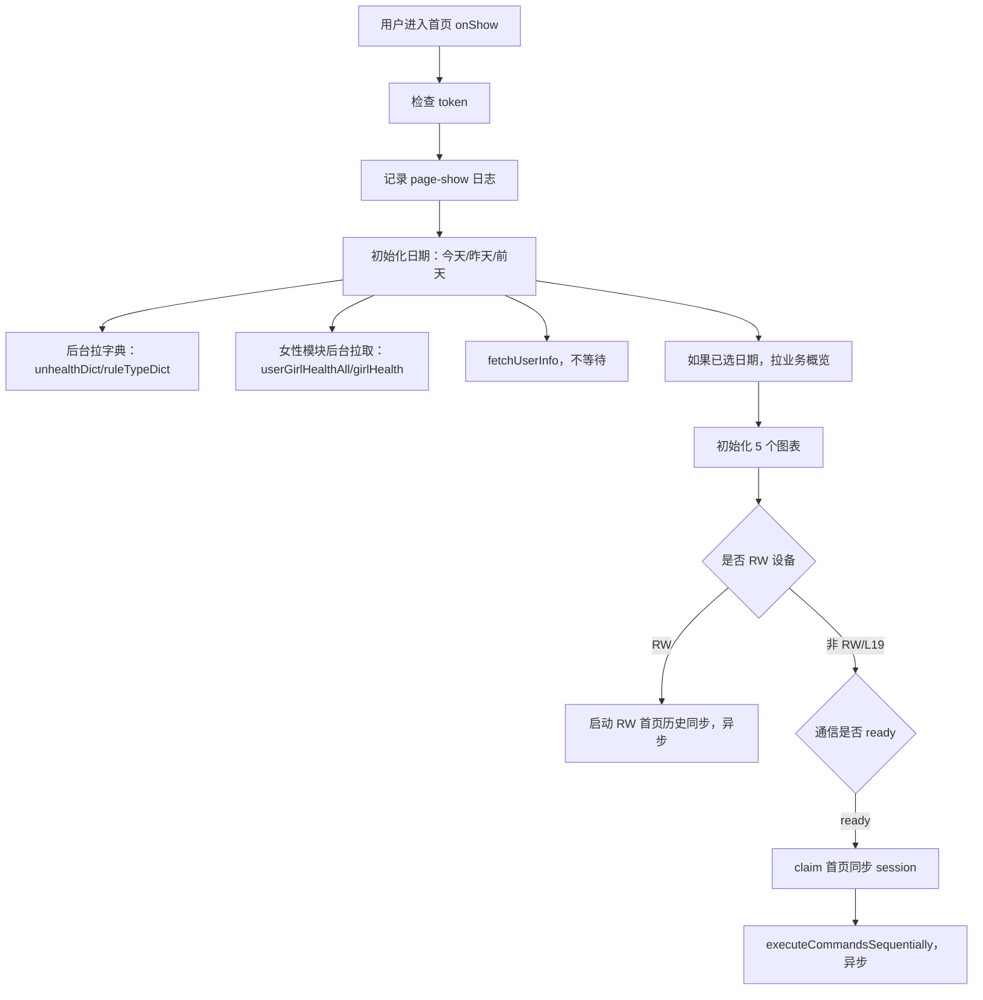
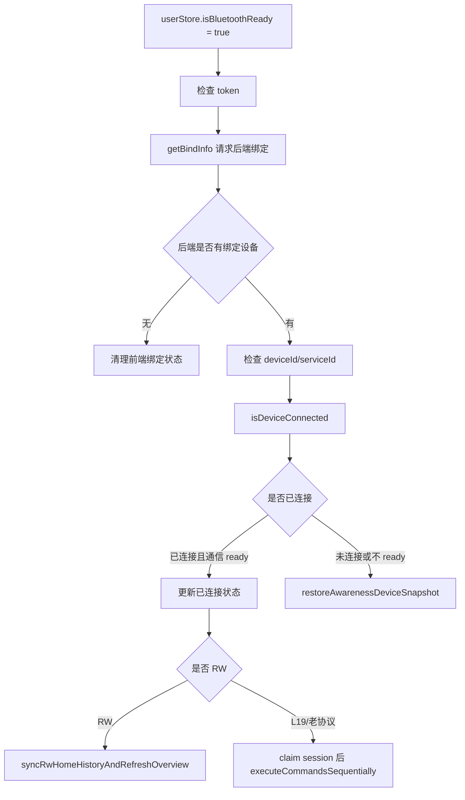
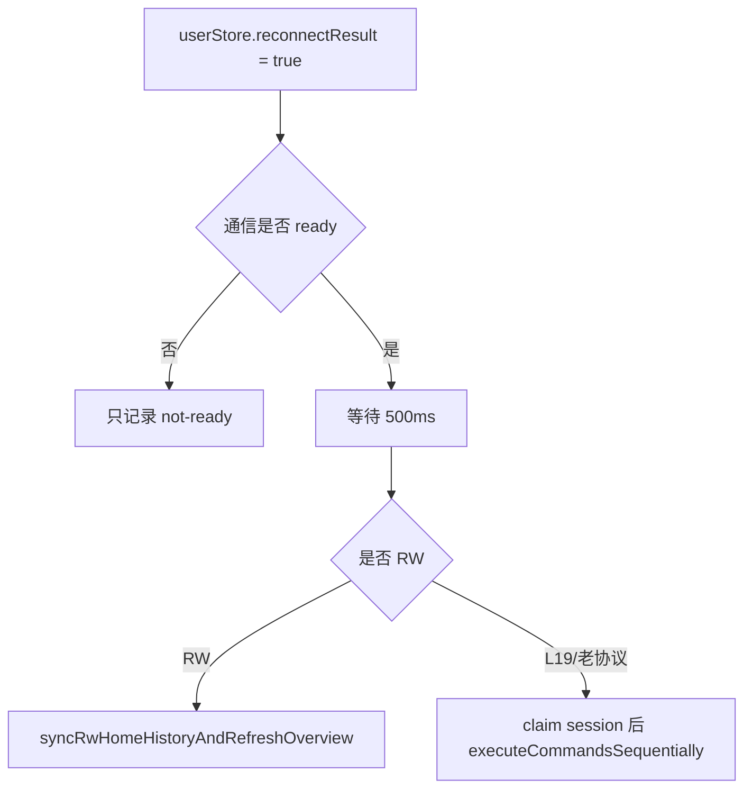
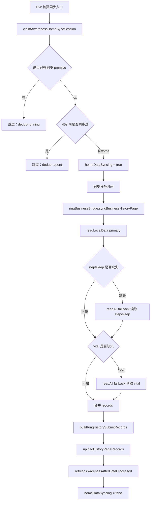
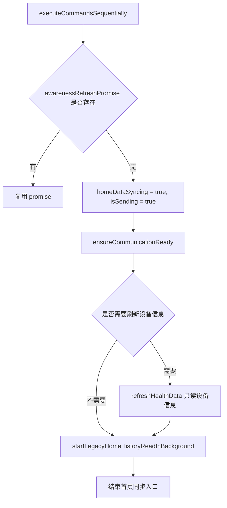
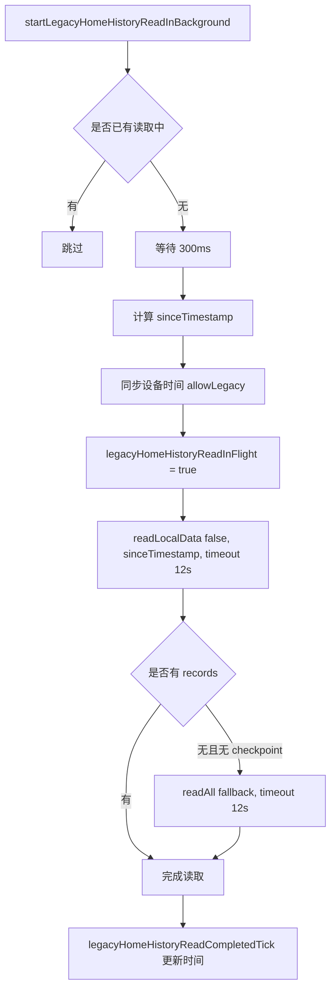
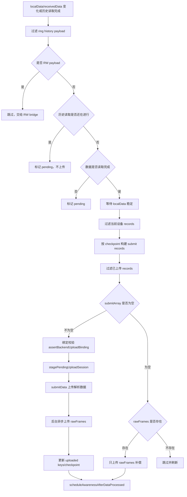
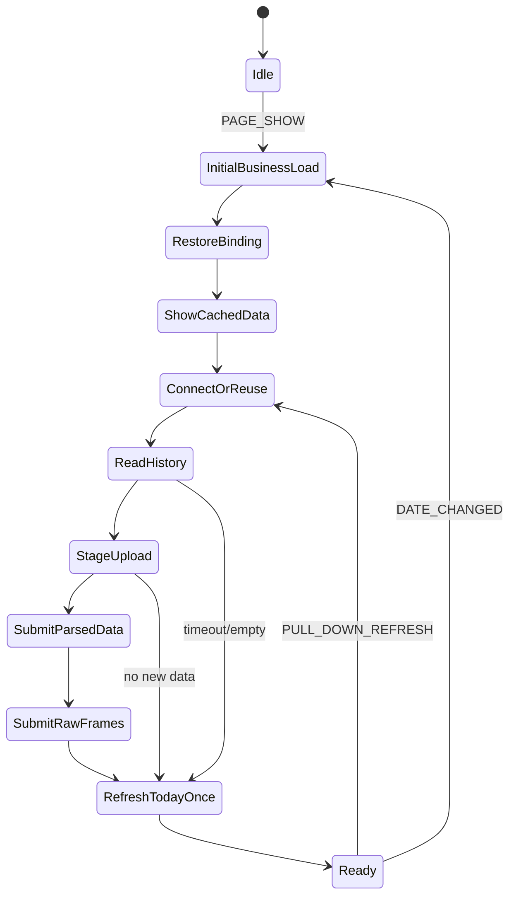

# 首页入口同步链路梳理与优化方案

日期：2026-08-03  
范围：小程序首页 `src/pages/awareness/awareness.vue` 以及它调用的蓝牙、历史读取、上传、业务刷新链路。  
原则：本文只整理链路和重构方案，不直接修改业务代码。

## 1. 结论

当前首页不是一个清晰的单链路，而是多个入口同时驱动同一批状态：

1. `onShow` 页面显示触发首次业务数据加载、图表初始化、蓝牙同步。
2. `userStore.isBluetoothReady` watcher 触发绑定确认、已连接检测、恢复连接、同步。
3. `userStore.reconnectResult` watcher 触发重连成功后的同步。
4. `userStore.localData / receivedData` watcher 触发 L19/老协议历史数据上传。
5. `onPullDownRefresh` 触发强制同步和业务刷新。

这些入口都可能修改：首页睡眠、活动、压力、生命体征、蓝牙状态、上传状态、设备信息、电量、图表。  
所以现在出现的问题不是单个 bug，而是链路边界不清：

- 页面生命周期、蓝牙连接、历史读取、数据上传、业务接口刷新混在一个页面文件里。
- L19 和 RW 的链路差异较大，但部分状态和 watcher 共用。
- 初始业务刷新、上传完成后的刷新、排队刷新会多次更新同一批卡片。
- 设备身份同时来自 `userStore`、`ringStore`、后端绑定、localStorage checkpoint，容易出现 B7/6E 串号。
- 历史读取、fallback、rawFrames 补偿、业务刷新都在首页进程里跑，用户会感知到“页面卡住/静默”。

建议后续不要继续按页面现象逐点补丁，而是先把首页统一到一个“首页同步调度器”。

## 2. 当前代码事实

### 2.1 首页主入口文件

文件：`src/pages/awareness/awareness.vue`

关键职责现在集中在同一个文件中：

- 页面生命周期：`onLoad`、`onShow`、`onPullDownRefresh`
- 蓝牙状态 watcher：`userStore.isBluetoothReady`
- 重连状态 watcher：`userStore.reconnectResult`
- 本地历史数据 watcher：`userStore.localData / receivedData`
- L19/老协议历史读取：`startLegacyHomeHistoryReadInBackground`
- L19/老协议首页同步：`executeCommandsSequentially`
- RW 首页历史同步：`syncRwHomeHistoryAndRefreshOverview`
- 首页业务接口刷新：`refreshAwarenessBusinessOverview`
- 上传后刷新：`refreshAwarenessAfterDataProcessed`

### 2.2 首页业务接口刷新

入口：`runAwarenessBusinessOverviewRefresh(date)`

当前一次业务刷新会并发请求：

- 目标数据：`getHomeGoalInfoData`
- 平衡分：`getBalanceScoreData`
- 睡眠概览：`getSleepOverviewData`
- 活动概览：`getMotionOverviewData`
- 压力：`getStressInfo`
- 生命体征：`getVitalSigns`

然后初始化图表：

- `initBalanceChart`
- `initSportChart`
- `initVitalChart`
- `initRelaxChart`
- `initSleepChart`

风险点：

- 这些接口用 `Promise.all` 汇总，一类接口慢会拖住整轮刷新日志结果。
- 页面初次刷新、同步完成刷新、排队刷新都可能覆盖同一批 UI 数据。
- 如果用户看到数据“一直变化”，通常不是图表自己变，而是多轮刷新在更新数据源。

### 2.3 设备身份来源

当前首页获取设备 key 的逻辑大致是：

1. 优先取 canonical mac。
2. 再从 `ringStore.boundDevice`、`ringStore.deviceInfo`、`userStore.deviceInfo` 中取。
3. 取值字段包括：
   - `mac`
   - `advertis.macInfo`
   - `deviceMac`
   - `device_mac`
   - `uniMacId`
   - `deviceId`
   - `deviceName`
   - `name`

`ringStore` 中实际保留了这些状态：

- `deviceInfo`
- `boundDevice`
- `receivedData`
- `historyRecords`
- `localData`
- `normalMac`
- `iosMacId`
- `isConnected`
- `reconnectStatus`
- `reconnectResult`
- `uploadingStatus`

checkpoint 文件：`src/utils/deviceHistoryCheckpoint.ts`

checkpoint key：

```text
protocol:normalizedMac
```

存储位置：

```text
qkeer:ring-device-history-checkpoints:v1
```

风险点：

- `userStore 当前设备` 和 `ringStore 当前设备` 并存，且首页两边都读。
- 如果其中一个 store 仍残留旧设备，可能出现 6E 链路里夹杂 B7 信息。
- 当前 checkpoint 是本地设备维度，不是后端唯一事实源；缺 checkpoint 时必须兜底覆盖昨晚睡眠窗口。

## 3. 当前首页实际链路

### 3.1 页面进入首页



说明：

- `onShow` 不是只展示缓存，它会发起业务刷新。
- 蓝牙同步是 `void` 异步启动，不阻塞 `onShow` 结束。
- 页面进入时已经可能发生一次业务刷新，后面同步完成后又会刷新一次。

### 3.2 蓝牙 ready watcher



说明：

- 这个 watcher 和 `onShow` 都可能触发同步。
- `claimAwarenessHomeSyncSession` 会按 `foregroundSessionId + deviceKey` 去重，但如果 deviceKey 不稳定，仍可能重复。

### 3.3 重连成功 watcher



说明：

- 重连成功后也会进首页同步。
- 如果同时发生 `onShow`、蓝牙 ready、reconnectResult，只有 session key 稳定时才能有效去重。

## 4. RW 首页同步链路

入口：`syncRwHomeHistoryAndRefreshOverview(date, reason, options)`



RW 当前已有的机制：

- 读取前可同步设备时间。
- 支持 primary read。
- 支持空数据或缺 step/sleep 的 fallback。
- 支持缺 heartRate/spo2/hrv/stress/temperature 等 vital 的 fallback。
- 上传接口 timeout 是 90 秒。
- 有 pending upload 和 uploaded record keys 本地缓存。

主要风险：

- fallback 可能多轮读取，耗时叠加。
- read + upload + processed refresh 都在首页链路里，页面容易被用户感知为卡顿。
- 上传后的刷新还是直接从首页触发。

## 5. L19 / 老协议首页同步链路

### 5.1 首页同步入口

入口：`executeCommandsSequentially()`



关键点：

- `executeCommandsSequentially` 本身不直接上传历史数据。
- 它只拉设备信息，然后启动后台历史读取。
- 历史数据上传依赖 `receivedData/localData` watcher。

### 5.2 L19 历史读取

入口：`startLegacyHomeHistoryReadInBackground(reason, protocol)`



风险点：

- 用户看到的“静默等待”主要来自这里：历史读取 timeout 或 fallback timeout。
- 当前读历史期间 watcher 会暂缓上传，等 completedTick 触发再处理。
- 如果没有明显 UI 状态，用户会认为页面卡住。

### 5.3 L19 上传 watcher

入口：`watch(() => [userStore.localData, legacyHomeHistoryReadCompletedTick.value])`



当前已有的保护：

- watcher running 去重。
- upload promise 去重。
- 60 秒相同 upload key 去重。
- 已上传 record keys 过滤。
- 后端绑定校验。
- rawFrames 异步补偿。
- 上传成功后更新 checkpoint。

主要风险：

- watcher 由数据变化驱动，不是明确的业务命令驱动。
- localData 多次变化会导致多次 pending/ready/result 日志和 UI 状态变化。
- rawFrames 后台上传虽是异步，但仍由首页启动，用户容易感知到“上传中状态一直存在”。
- 如果 deviceMac 在上传过程中变化，会出现当前设备和数据来源不一致。

## 6. 当前问题和对应根因

| 现象 | 当前链路中的可能根因 | 应该从哪里治理 |
|---|---|---|
| 首页进来后长时间没反应 | L19 历史读取 12s timeout / RW fallback 30s / 上传接口 90s / 业务刷新并发等待 | 首页同步调度器，明确状态和超时降级 |
| 蓝牙状态连接/断开/再连接 | 页面入口、ready watcher、reconnect watcher 都可能改连接状态 | 统一连接状态机 |
| 首页数据一直变化 | 初始业务刷新、同步后刷新、排队刷新多次写卡片 | 业务刷新只允许关键阶段触发一次 |
| 睡眠首页和详情不一致 | 首页读概览接口，详情读详情接口；前端还可能用 localData/chart 构造 | 后端接口统一同一份解析结果，前端只渲染 |
| 6E/B7 串号 | 设备 key 来源混合，store 中可能残留旧设备 | 单一设备上下文，后端绑定为唯一事实源 |
| 重复上传 | 本地去重依赖 deviceMac + record key；如果 deviceMac/recordTime/value 不稳定，会失效 | 后端唯一约束 + 前端 checkpoint |
| 页面跳转 5~10 秒没反应 | 点击事件可能等待同步/刷新；没有 route lock 和即时反馈 | 导航和数据加载解耦，页面先进入再加载 |
| 进入详情没有数据或图表空 | 详情页依赖接口慢或返回结构不完整；图表可能等待 ECharts 初始化 | 详情页只负责 query + render，不触发同步 |

## 7. 建议的目标链路

目标：用户进入首页后，所有静默和业务动作都走一个通道。页面只派发事件，不直接散落执行同步。

### 7.1 统一事件

首页只允许这些事件进入调度器：

- `PAGE_SHOW`
- `BLE_READY`
- `RECONNECT_READY`
- `PULL_DOWN_REFRESH`
- `DATE_CHANGED`
- `UPLOAD_JOB_DONE`

### 7.2 统一设备上下文

每次进入同步前先生成 `HomeDeviceContext`：

```ts
type HomeDeviceContext = {
  userId: string | number;
  bindingId?: string | number;
  bindingVersion?: string | number;
  dataUserId?: string | number;
  deviceMac: string;
  deviceName?: string;
  protocol: 'l19' | 'rw' | 'legacy' | 'unknown';
  source: 'backend-binding';
};
```

规则：

1. 后端当前绑定是唯一事实源。
2. `ringStore` 和 `userStore` 只能缓存这个事实源，不再互相兜底生成当前设备。
3. checkpoint key 必须使用 `protocol + deviceMac`。
4. 如果当前连接设备和后端绑定设备不一致，停止上传，只做日志，不弹用户错误。

### 7.3 首页统一状态机



状态原则：

- 首屏先显示后端已有今日数据，不等蓝牙。
- 蓝牙连接、历史读取、上传都不阻塞页面跳转。
- 同一个 `{foregroundSessionId, userId, deviceMac}` 只允许一个同步任务。
- 上传完成后只刷新一次今日数据。
- 失败时只记录诊断，用户侧展示“数据同步稍后完成”，不要弹技术错误。

## 8. 推荐修复顺序

### 第一阶段：冻结现有链路，补一层调度器，不改协议

目的：先把入口统一，停止“多入口互相打架”。

要做：

1. 新增 `useHomeEntrySyncOrchestrator`。
2. `onShow`、蓝牙 ready watcher、reconnect watcher、下拉刷新，都只调用 `orchestrator.enqueue(event)`。
3. 调度器内部复用现有函数：
   - RW：复用 `syncRwHomeHistoryAndRefreshOverview`
   - L19：复用 `executeCommandsSequentially`
   - 上传 watcher 暂时保留
4. 增加 route lock：详情页点击立即进页，数据异步加载，禁止 5~10 秒无反馈。

验收：

- 首页单次进入最多产生一次同步 session。
- 首页数据最多两次变化：首次业务数据、同步后业务数据。
- 点击详情页不会连续打开多个页面。

### 第二阶段：拆 L19 上传 watcher

目的：L19 不再靠 `localData` watcher 隐式上传。

要做：

1. `startLegacyHomeHistoryReadInBackground` 返回明确的 `records/result`。
2. 调度器拿到 records 后显式调用 `uploadLegacyHistoryRecords`。
3. localData watcher 降级为兼容兜底，不作为主链路。
4. 上传状态只在调度器里设置。

验收：

- 日志能看到完整链路：
  - `home-sync-start`
  - `binding-check-start/result`
  - `history-read-start/result`
  - `upload-start/result`
  - `business-refresh-start/result`
- 不再出现 localData 每变化一次就触发一次上传判断。

### 第三阶段：上传改后台 job，前端只提交 rawFrames/manifest

目的：上传补偿不占用首页进程。

要做：

1. 前端读取到历史数据后先落 rawFrames。
2. 前端提交一个轻量 job：
   - `user_id`
   - `device_mac`
   - `protocol`
   - `session_id`
   - `raw_frame_ids` 或 raw file 地址
3. 后端定时任务解析 rawFrames 入库。
4. 前端收到 job accepted 后即可释放 UI。

验收：

- 前端上传阶段不超过 3~5 秒。
- 后端解析慢不影响首页、详情页打开。
- rawFrames 能按日期/用户/设备重新解析修复。

### 第四阶段：统一首页和详情的数据源

目的：睡眠首页、睡眠详情、图表、统计都来自同一份后端解析结果。

要做：

1. 睡眠详情不再根据前端 localData 拼统计。
2. 后端返回：
   - `sleepWindowStart`
   - `sleepWindowEnd`
   - `totalSleepMinutes`
   - `stateStats`
   - `segments`
   - `vitalsDuringSleep`
3. 前端只渲染，不再重新计算深睡/浅睡/REM/清醒。
4. 清醒只统计睡眠窗口内数据，不统计 21:00~11:00 全窗口空白。

验收：

- 首页睡眠时长 = 详情睡眠时长。
- 饼图统计 = 睡眠时间图底部统计。
- 图中 segments 总和 = `totalSleepMinutes`。
- 清醒不会包含入睡前和起床后的空白时段。

## 9. 首页进入后的目标用户体验

用户进入首页后应该是：

1. 0~1 秒：展示后端已有今日数据和缓存设备状态。
2. 1~3 秒：如果蓝牙可用，显示“正在连接/同步”小状态，不挡页面。
3. 连接成功后：读取设备信息，电量稳定后更新一次。
4. 历史读取中：不阻塞页面点击；只显示轻量状态。
5. 上传 accepted 后：关闭上传状态。
6. 后端处理完成或短轮询完成后：只刷新一次今日数据。
7. 若后端处理慢：展示“数据同步中，稍后自动更新”，不要卡首页。

## 10. 后续修改红线

后续修复首页问题时，建议遵守：

1. 不再直接在页面新增 watcher 触发上传。
2. 不再同时修改 `userStore.deviceInfo` 和 `ringStore.deviceInfo` 而不经过统一设备上下文。
3. 不再由前端详情页重新推导睡眠统计。
4. 不再把后台 rawFrames 上传失败作为用户弹窗。
5. 不再让详情页跳转等待蓝牙或上传流程。
6. 每次修改必须能回答：这个动作属于状态机哪一步、触发条件是什么、结束条件是什么。

## 11. 建议下一步

建议先做第一阶段：

- 新增首页同步调度器。
- 不改 L19/RW 协议。
- 不改后端接口。
- 只把入口收敛起来，防止后续继续反复打补丁。

完成第一阶段后，再用 6E、B7 各跑一条完整日志，看：

- 进入首页到展示缓存数据耗时。
- 蓝牙连接耗时。
- 历史读取耗时。
- 上传 accepted 耗时。
- 业务刷新耗时。
- 是否只刷新一次今日数据。
